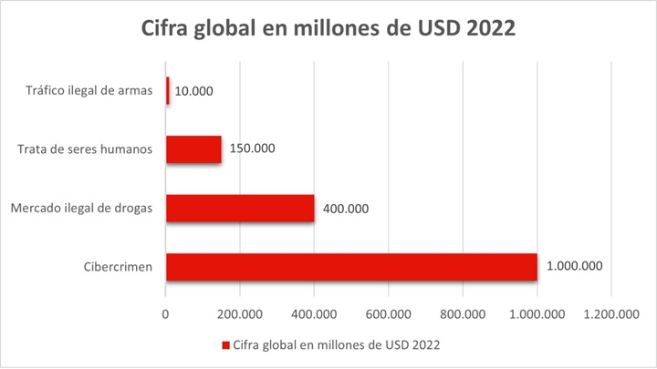

# AA1. Conceptes bàsics de seguretat informàtica

Disciplina encarregada de protegir la informació i els sistemes informàtics.

Conceptes relacionats:

- Ciberseguretat: defensa dels sistemes informàtics davant d’atacs maliciosos. És una part de la seguretat informàtica.
- Seguretat de la informació: conjunt de mesures que permeten protegir la informació (no només amb sistemes informàtics).

És una de les disciplines que més importància ha adquirit en els darrers anys, ja que la majoria de les activitats humanes es realitzen amb l’ajuda de sistemes informàtics i per tant, la informació que es genera i s’emmagatzema en aquests sistemes és molt valuosa.

> **Cas real: SEPE**
>
> El Servicio Público de Empleo Estatal (SEPE) va patir un atac informàtic de tipus ransomware (Ryuk) que es va detectar el 9 de març del 2022. L’atac va afectar al funcionament del servei d’ocupació durant mesos, va provocar la caiguda de la web i la pèrdua d’expedients que es van haver de tornar a generar, amb les molèsties que això va suposar per a les persones usuàries i el cost en hores extra de treball per a l’administració pública.

Per tant, és evident que caldrà aplicar mesures de seguretat per evitar que es produeixin incidents com aquest, i si es produeixen, minimitzar-ne les conseqüències. Però cal tenir clar que la **seguretat absoluta no existeix**.

>“The only truly secure system is one that is powered off, cast in a block of concrete and sealed in a lead-lined room with armed guards — and even then, I have my doubts.”
>
>Eugene Spafford. Prof. Universitat de Purdue i expert en seguretat informàtica.

## Principis bàsics de la seguretat informàtica

En el camp de la seguretat de la informació, hi ha tres principis bàsics que cal tenir en compte:

- **Confidencialitat**: només les persones autoritzades poden accedir a la informació.
- **Integritat**: la informació no pot ser modificada per persones no autoritzades.
- **Disponibilitat**: la informació ha d’estar disponible quan sigui necessària.

Aquests principis són coneguts com a **CIA** (Confidentiality, Integrity, Availability) i són la base de qualsevol política de seguretat informàtica.

A més d’aquests principis, la seguretat informàtica afegeix dos conceptes més:

- **Autenticació**: permet verificar la identitat d’una persona o sistema.
- **Vinculació (no rebuig)**: garanteix que una persona no pugui negar haver realitzat una acció. Exemple, en una transacció bancària, que el client no pugui negar haver realitzat la transferència i el receptor no pot negar haver-la rebut.

Per això, en el camp de la seguretat informàtica, es parla de **CIA + AV** (Confidentiality, Integrity, Availability + Authentication, Verification) o **CIDAV** si fem l'acrònim en català.

## Actius

I què cal protegir? Els elements que cal protegir s’anomenen **actius** i poden ser de diferents tipus:

- **Actius físics**: ordinadors, servidors, impressores, etc.
- **Actius lògics**: sistemes operatius, aplicacions, bases de dades, etc.
- **Informació**: el contingut que es genera i s’emmagatzema en els sistemes informàtics, com ara documents, correus electrònics, fitxers multimèdia, etc.
- **Comunicacions**: les xarxes i canals de comunicació que permeten la transmissió de la informació.
- **Reputació**: la imatge que una empresa o persona té davant de la societat. La pèrdua de reputació pot tenir conseqüències econòmiques molt importants.

> **Cas real: Sony PlayStation Network**
>
> L'any 2011, la plataforma en línia PlayStation Network va patir un atac històric. Els delinqüents van robar dades de milions de comptes, inclosos noms i es rumoreja que informació bancària. Sony va haver de tancar la xarxa durant setmanes. Això va provocar una reacció negativa dels usuaris i una pèrdua de confiança en la marca, afectant les vendes i el valor de la companyia (les accions van patir una força caiguda).

## Ciberdelinqüència

La ciberdelinqüència és l’activitat delictiva que es realitza amb l’ajuda de sistemes informàtics, conforme ha augmentat la dependència de les tecnologies de la informació, l'activitat delictiva ha crescut exponecialment. Segons diversos estudis, s'estima que el cost de la ciberdelinqüència a nivell mundial és de **10,5 bilions de dòlars anuals** (bilions: milions de milions de dòlars) [Font: StationX](https://app.stationx.net/articles/cybercrime-statistics).

El cibercrim mou directament diners, ja sigui a través de robatori d’informació bancària, extorsió amb ransomware, estafes en línia, etc. Al 2022 es valorar que movia al voltant del bilió de dolars, superant altres negocis il·lícits com el tràfic de drogues o el tràfic de persones.

> Font: [IT User](https://www.ituser.es/actualidad/2023/06/el-valor-del-cibercrimen-se-aproxima-al-15-del-pib-mundial)

## Classificació de la seguretat informàtica

Segons els recursos a protegir tenim:

- **Seguretat física**: Consisteix a protegir les dades i els sistemes informàtics davant d’amenaces físiques, com ara robatoris, incendis, inundacions, etc.
- **Seguretat lògica**: Mesures que asseguren programes i dades usant barreres digitals, com ara tallafocs, antivirus, sistemes de detecció d’intrusions, etc.

Segons quan actuen:

- **Seguretat passiva**: Mesures que una vegada produït l'atac, minimitzen els efectes i recuperen l'estat anterior. Relacionat amb la resiliència (capacitat del sistema de recuperar-se després d'un desastre).

- **Seguretat activa**: Mesures per detectar amenaces i evitar el problema, abans que es produeixi.

### Exemples d'amenaces a la seguretat física

- Desastres naturals
- Incendis i inundacions
- Robatoris
- Fallades de subministrament (apagades i sobretensions)
- Fallades de maquinari

### Exemples d'amenaces a la seguretat lògica

- Virus, Troians i malware en general.
- Pèrdua de dades davant mal funcionament de programari.
- Atacs humans a aplicacions dels servidors: locals o remots aprofitant vulnerabilitats.
- Errades humanes dels usuaris del sistema.

## Organització de la seguretat per capes

Model de defensa que organitza les proteccions en capes o nivells.

Avantatges:

- Disminueix risc que atac tingui èxit.
- Divideix la defensa en objectius més petits i, per tant, més fàcils d’assolir i mantenir.

És important centrar-se en cada un d'aquests nivells per separat i aconseguir el nivell més alt possible de seguretat en cadascuna d'elles, no serveix de res tenir un nivell alt de seguretat en una capa si les altres són molt vulnerables.

| Capa de seguretat | Mesures / Descripció |
| :--- | :--- |
| **Dades** | ACL, xifrat, passwords segurs |
| **Aplicació** | Reforç de les aplicacions, Antivirus |
| **Host** | Reforç del sistema operatiu, actualitzacions, autenticació, HIDS, Antimalware |
| **Xarxa interna** | Segments de xarxa, IPSec, NIDS |
| **Perímetre** | Firewalls, sistemes de quarantena en VPN |
| **Seguretat física** | Guàrdies, bloqueig, panys, SAI |
| **Directives, procediments i conscienciació** | Programes d'aprenentatge per a usuaris |

| [⬆️](./README.md)Tornar a inici NF1 | |[➡️](./AA2-SeguretatFisica.md)AA2 Seguretat Física |
| :--- | :--- | :--- |
