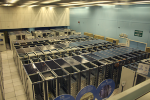
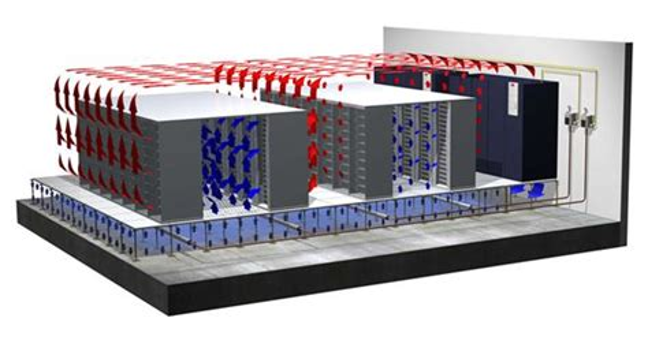
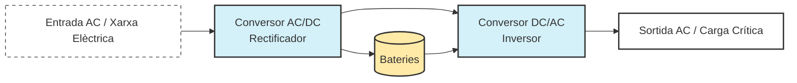
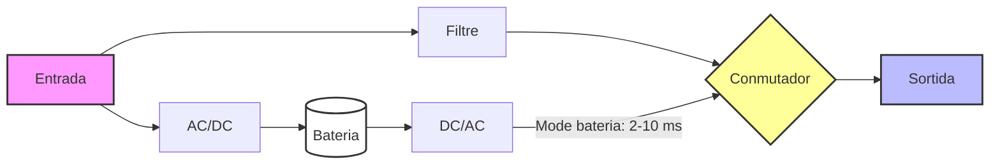
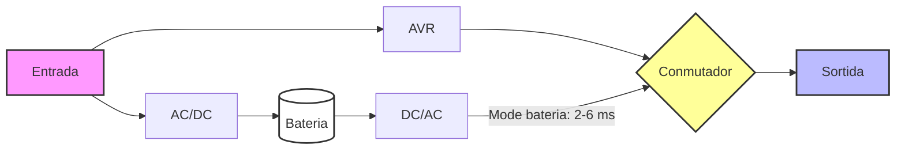
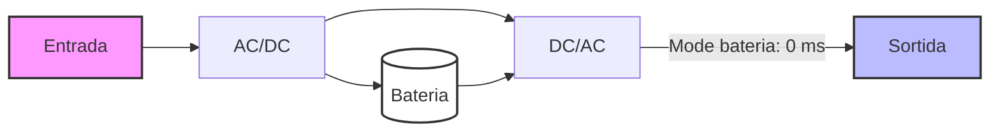
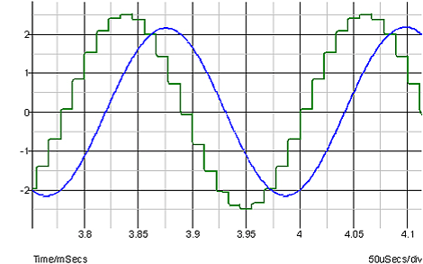

# AA2 Seguretat física

## Seguretat a l'entorn físic

**Entorn físic**: espais on es troben els equips informàtics.Poden ser oficines, l’aula on estem ara mateix o bé espais especialitzats on s’ubiquen els servidors i equipament com armaris de comunicació que s’anomenen centres de processament de dades (CPD). Cal que aquest entorn físic compleixi unes normes de seguretat per minimitzar els riscos sobre el hardware de l’organització.

Les amenaces que poden afectar l’entorn físic són:

- Fallada dels serveis de subministrament:
- Tall de comunicacions
  - Talls elèctrics
  - Pujades de tensió
- Catàstrofes:
  - Inundacions
  - Incendis
- Intrusions:
  - Robatoris
  - Accessos no autoritzats

## La sala de servidors (CPD)

De tot l’equipament informàtic, el més crític a l’hora de protegir físicament és el que conforma l'estructura troncal de la infraestructura, això inclou servidors, sistemes emmagatzematge, equipament de xarxa, etc.

Habitualment se situen una sala de servidors o CPD (Centre de Processament de Dades) o en el cas de grans empreses o de proveïdors de serveis, en centres de dades (Data Center) que poden allotjar servidors de diferents empreses. Aquests espais han de complir una sèrie de requisits per garantir la seguretat física i la continuïtat del servei.

La sala que allotjarà el CPD ha de complir una sèrie de requisits:

- Seguretat a intrusions: control d’accessos, vigilància, alarmes, etc.
- Seguretat davant catàstrofes: sistemes de detecció i extinció d’incendis, sistemes de control d’humitat i temperatura, etc. Evitar soterranis pel risc d’inundació.
- Protecció davant interferències electromagnètiques que puguin afectar el funcionament dels equips.

> Òbviament, aquests requisits són més estrictes en un Data Center que en una sala de servidors d’una empresa, però el concepte és el mateix.

### Condicions ambientals

Cal protegir els equips i persones de:

- **Temperatura**: Els equips dissipen molta calor. Necessiten ventilació i una temperatura controlada.
- **Humitat**: Aigua i humitat ambiental alta poden provocar corrosió, i baixa electricitat estàtica. Potser necessari usar deshumidificadors.
- **Interferències electromagnètiques**: allunyar de màquines que poden generar-les (generadors elèctrics, maquinària industrial, fluorescents, etc).

#### Temperatura i humitat

Els equips informàtics generen molta calor, per això les sales de servidors s'anomenen sales fredes, perquè es mantenen a una temperatura baixa i constant. La temperatura ideal és d’uns 20-22ºC i la humitat relativa entre el 40% i el 60%. Per aconseguir-ho, s’instal·len sistemes de climatització i ventilació que permetin mantenir aquestes condicions.

Ens instal·lacions grans per afavorir la circulació d’aire s’utilitza la tècnica de **passadís fred i passadís calent**.

L'objectiu és que l’aire fred que surt dels equips de climatització arribi a la part frontal dels servidors i que l’aire calent que expulsen els servidors sigui evacuat per la part posterior. D’aquesta manera s’evita que l’aire calent es barregi amb l’aire fred i es manté una temperatura adequada.

### Detecció i extinció d’incendis

Un incendi representa un risc tant pels equips com per les persones.

Els sistemes informàtics es poden danyar segons el sistema d’extinció d’incendis emprat, òbviament no sembla gaire bona idea extingir un incendi amb una mànega d’aigua quan hi ha equips elèctrics.

Sistemes d'extinció d’incendis:

- Aigua nebulitzada: es tracta d’un sistema que allibera una boira d’aigua que redueix la temperatura i l’oxigen de l’aire. És un sistema segur per a les persones i els equips.

- Gasos inerts: es tracta d’un sistema que allibera gasos com el CO2 (ja no molt popular) o l'[Inergen](https://es.wikipedia.org/wiki/INERGEN). Són un sistema segur per als equips però no per a les persones, ja que poden morir per asfíxia.

- Sistemes com ([Novec 1230](http://es.novecsystems.com)) líquids que permeten l'extinció i en no ser conductors no afecten els equips. És un sistema segur per a les persones i els equips.

En instal·lacions petites, no tindrem un sistema d’extinció d’incendis automàtic, però sí que haurem de disposar d’extintors i senyalització adequada.

Els més recomanats:

- Aigua polvoritzada: segur i net.
- Extitors CO2: no deixa residus.
- Halotron: gas inert i que no deixa residus.

En cap cas es bona idea usar extintors de pols, ja que deixen residus que poden danyar els equips.

> A Espanya la normativa (UNE-EN 2) classifica els incendis en 5 tipus: A (sòlids), B (líquids), C (gasos), D (metalls) i F (olis de cocció). A la norma europea no s'especifica una classe específica per a incendis elèctrics (a la norma nordamericana sí, tipus C), els extintors indiquen fins a quina tensió és segur usar-los i a quina distància. Per exemple, 35000 V a més d'1 metre de distància.

### Control d'accessos

Objectiu impedir l’accés no autoritzat. Les mesures poden ser:

- **Dissuasives**: dificulten l'accés i dissuadeixen a intrusos. Per exemple, tanques, cartells, etc.
- **Detecció intrusos**: s'utilitzen sensors i càmeres per detectar i registrar l'accés no autoritzat.
- **Control accés físic**: s'utilitzen sistemes de control d'accés com targetes d'accés, claus o biometria. Idealment, el sistema hauria de contemplar la identificació (identificar qui entra), l'autorització (permetre l'accès a qui està autoritzat) i el registre (per tenir una evidència de l'accés).

> Una porta amb pany és un exemple de control d'accés només amb autorització (entres si tens clau), però no hi ha identificació ni registre. Un sistema de control d'accés amb targeta d'identificació permet identificar qui entra, autoritzar l'accés i registrar-ho.

### Nivell seguretat dels CPD

Els datacenters es classifiquen segons el nivell de seguretat que ofereixen. La classificació més utilitzada és la de l’[Uptime Institute](https://uptimeinstitute.com/), que defineix 4 nivells de seguretat (tier):

| Nivell | Descripció |
| :--- | :--- |
| **Tier I** | Instal·lació bàsica sense components redundants. |
| **Tier II** | Instal·lació amb alguns components redundants. |
| **Tier III** | Instal·lació amb components redundants i múltiples camins de distribució d’energia i refrigeració. Permet fer manteniment sense apagar els equips. |
| **Tier IV** | Tota la instal·lació està duplicada amb respaldament automàtic, per exemple, ha de disposar de dues línies de subministrament elèctric independents. |

Aquests nivells permeten assegurar el nivell de disponibilitat de la instal·lació que va del 99,671% (Tier I) al 99,995% (Tier IV). O dit d'una altra manera, en un tier I, la instal·lació pot estar fora de servei 28,8 hores a l’any, mentre que en un tier IV només 26 minuts. Podeu trobar més informació en aquest [enllaç](https://blogs.salleurl.edu/es/el-estandar-tia-942-y-los-tier).

## Protecció davant fallades de subministrament elèctric

Els sistemes informàtics depenen completament de l’electricitat. Tot i que podem pensar que l’únic inconvenient és que se’n vagi l’electricitat i que ens quedem sense alimentació elèctrica, també poden ser un problemes les pujades de tensió que poden danyar els equips, les baixades de tensió o els sorolls o harmònics que poden afectar el funcionament dels equips. En el següent article de SALICRU teniu un resum dels principals problemes que poden afectar la xarxa elèctrica [enllaç](https://www.salicru.com/calidad-de-red/calidad-de-red.html).

La solució és disposar d'una protecció davant fallades de subministrament elèctric. La solució més habitual és un SAI (Sistema d’Alimentació Ininterrompuda) que permet continuar funcionant durant un temps limitat i a més, a la majoria de models, filtrar les pujades i baixades de tensió.

> Ens instal·lacions crítiques com són els datacenters, s'ha d'assegurar la continuïtat del funcionament. Per això, a més del SAI, s'instal·len generadors elèctrics que permeten continuar funcionant durant hores o dies fins que es restableixi el subministrament elèctric.

### El SAI (Sistema d’Alimentació Ininterrompuda)

És un dispositiu que permet alimentar els equips connectats a ell quan hi ha fallada de voltatge, permentent continuar funcionant durant un temps limitat. La majoria de models actuals milloren la qualitat de l'energia elèctrica que arriba als aparells (filtrat).

A grans trets, el SAI consta de:

- Un convertidor AC/DC que transforma el corrent altern de la xarxa en corrent continu per carregar les bateries.
- Unes bateries que emmagatzemen l’energia elèctrica.
- Un convertidor DC/AC que transforma el corrent continu de les bateries en corrent altern per alimentar els equips connectats al SAI.

### Tipus de SAI

En funció de la tecnologia que utilitzen, els SAI es classifiquen en tres tipus:

- **Offline**: el SAI només s’activa quan hi ha una fallada de subministrament elèctric. És el més econòmic i el més utilitzat en entorns domèstics i petites empreses. Davant una caiguda commuta (temps de transferència típic sobre 6 ms). Sol incorporar un filtre per protegir contra sobretensions, però que no protegeix contra fluctuacions (pujades i baixades de tensió) de la xarxa.

- **Line-interactive**: Usa un regulador de tensió automàtic (AVR)per controlar pujades i baixades de tensió. Davant una caiguda commuta (temps de transferència típic sobre 2 ms). És una mica més car que l'anterior, però actualment és el més utilitzat en entorns professionals.

- **Online** (doble conversió)*: Sempre s’alimenta a partir de l'inversor DC/AC, senyal regenerat, per tant, no hi ha temps de transferència.Protecció contra tot tipus de problema de la línia.Ús en servidors, equipament crític o centres de dades, etc., perquè són els models més cars.

### Potència elèctrica (Watts i VA) i el factor de potència

A corrent altern hi ha dos conceptes complementaris:

- Potència eficaç o activa(watts): és la que s’aprofita com a potència útil.
- Potència aparent (VA): és la potència total que l’equip agafa de la línia.

La diferència és a causa del comportament **reactiu** d’alguns components que emmagatzemen energia i la retornen, es comporten de forma similar a com ho fa una molla que emmagatzema energia quan es comprimeix i la retorna quan es deixa anar. Aquest comportament provoca que la potència aparent sigui superior a la potència activa. En aquest [vídeo](https://youtu.be/6LXYRIDVuIg?si=aSxZk3dw8cYPgvHg) teniu una explicació més detallada.

La relació es defineix amb el **factor de potència**  que es calcula com el quocient entre la potència activa i la potència aparent. El factor de potència és un valor entre 0 i 1:

$$ \text{Factor de potència} = \frac{\text{Potència activa (W)}}{\text{Potència aparent (VA)}} $$

Una font d'alimentació de PC tindria un factor de potència d'aproximadament 0,7, per millorar l'eficiència de la xarxa elèctrica, la normativa obliga a usar un dispositiu corrector del factor de potència (PFC) que permet que el factor de potència sigui més elevat. De fet els PFC actius o APFC permeten que el factor de potència superiors a 0,90.

> A manteniment quan vau estudiar les fonts d'alimentació vau sentir conceptes com [Energy Star](https://www.energystar.gov/) que classifica les fonts d'alimentació segons la seva eficiència (Silver, Gold, etc.). En el cas de la Unió Europea el reglament és similar [UE 617/2013](https://eur-lex.europa.eu/LexUriServ/LexUriServ.do?uri=OJ:L:2013:175:0013:0033:ES:PDF).

El propi SAI en quant és un aparell elèctric també té un factor de potència (de fet en té dos, un a l’entrada i un a la sortida, però nosaltres només estem interessats en el de sortida). Aquest factor de potència de sortida del SAI ens indica quin tipus de càrrega pot alimentar (relació entre W i VA). Exemple: un SAI de 1000 VA i FP=0,8, pot alimentar càrregues de fins 800 W. Els models actuals solen tenir factors de potència de 0,9 i fins i tot 1,0.

### Senyal de sortida del SAI

El SAI quan treballa amb bateries o en sempre en el cas dels online, alimenta a partir d’un senyal altern generat per l’inversor. Aquest dispositu recrea una ona a partir del corrent continu de les bateries. Tot i que l'ideal seria que fos una ona sinusoidal pura, la majoria de models econòmics generen una ona requadrada o quasi sinusoidal que al gràfic podeu veure en color verd. Els models més cars generen una ona sinusoidal pura (senyal blau).

I això per què és important? Doncs perquè els equips amb APFC (PFC activa) requereixen una ona d’entrada relativament neta (si no, el APFC desconnecta la font d’alimentació). Un SAI amb sortida sinusoidal no ens donarà problemes. En el cas dels SAIs amb sortida quasi sinusoidalcal comprovar que sigui compatible amb equips amb APFC.

### Dimensionament del SAI

Per dimensionar correctament un SAI caldrà seguir el següent procediment:

- Se sumen les potències (normalment tindrem les efectives en watts) de tots els equips que es vulguin protegir. En el cas de servidors i equips nous es pot agafar un factor de potència de 0,9, si no tenim dades, s’agafa un valor conservador de 0,7 per obtenir el total de VA.
- Se sol triar un marge de seguretat de manera que el la potència calculada no arribi  al 100% de la potència màxima del SAI (tip. 80%).
- Es comprova que el SAI triat tingui una potència suficient en VA i en W, cas que el SAI tingui factor de potència inferior a 1, caldrà comprovar les dues potències.
- Verificar que el temps d’autonomia del SAI sigui suficient per apagar els equips amb seguretat. En cas que no sigui suficient, o bé es poden afegir bateries addicionals (si el model ho permet) o bé es pot triar un SAI amb més potència.

Hi ha una fórmula aproximada per calcular el temps d’autonomia del SAI:

$$ T (minuts) = \left( \frac{\text{Capacitat bateries (Ah)} \cdot \text {Voltatge (12 V)} \cdot \text{Eficiència}}{\text{Pot. W}} \right) \cdot 60 $$

>Eficiència: Rendiment del SAI durant la conversió de l'energia de la bateria (es sol estimar entre un 0,8 i un 0,9, és a dir, un 80%-90% d'eficiència, a causa de la pèrdua de calor).

Els diferents fabricants solen oferir calculadores de dimensionament del SAI, que permeten introduir les potències dels equips i obtenir el model de SAI més adequat:

- [APC UPS Selector](https://www.apc.com/shop/es/es/tools/ups_selector/)
- [Salicru Recommender](https://www.salicru.com/recomendador-sais.html)
- [Eaton UPS Selector](https://powerquality.eaton.com/UPS/selector/SolutionOverview.asp?cx=97)
- [Riello UPS Product Selector](https://www.riello-ups.es/product-selector)

Altres aspectes a considerar a l’hora de triar un SAI són:

- Temps de transferència: el temps que triga a passar de la xarxa a les bateries. Els models online no tenen temps de transferència, mentre que els offline poden tenir fins a 6 ms i els line-interactive fins a 2 ms.
- Temps de recàrrega de les bateries: el temps que triga a carregar les bateries després d’una fallada de subministrament.
- Factor de forma: el SAI pot ser de sobretaula, torre o en format rack. En entorns professionals és habitual que siguin en format rack, tot i que les bateries solen ser externes i en format torre.
- Preu

Anem a fer un exemple de dimensionament d’un SAI per una oficina amb 15 ordinadors i monitors i un rack amb el servidor, switch, sistema backup etc.

- Consultant els consums típics dels equips, obtenim una potència total de 5862 W.
- Considerant un factor de potència mitjà de 0,9, obtenim una potència aparent de 6513 VA.
- Aplicant el marge de seuretat del 80%, obtenim una potència de 8142 VA.

Usant l'eina de selecció de SAI d'APC, obtenim que el model més adequat és un SAI SMART-UPS-SRT de 10 kVA. Amb aquest model realment estem usant el 65% de la seva potència màxima, i ens proporcionarà una autonomia d'uns 20 minuts aproximadament.

| [⬆️](./README.md)Tornar a inici NF1 | [⬅️](./AA1-ConceptesSI.md)AA1 Conceptes de Seguretat Informàtica | [➡️](./AA3-SeguretatLogica.md)AA3 Seguretat Lògica |
| :--- | :--- | :--- |
