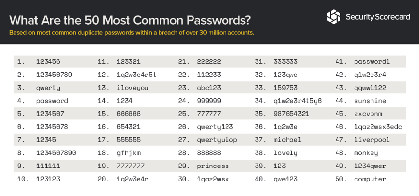
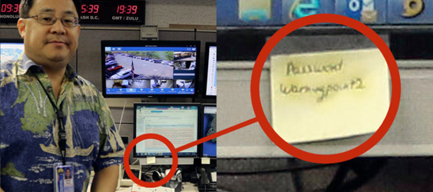
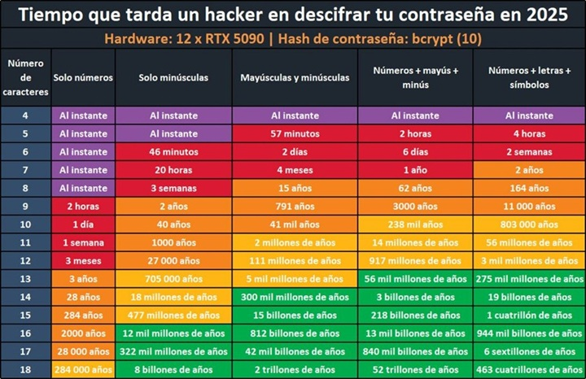
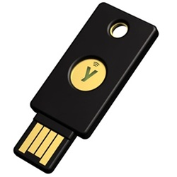
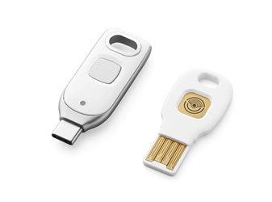
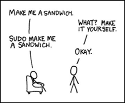

# AA3 Seguretat lògica

Un cop assegurat l’accés físic, el següent nivell és protegir l’accés lògic al sistema informàtic.
**Objectiu**: assegurar-se de que qui pretén accedir a un recurs està autoritzat realment a fer-ho.

## Control d’accés

Reconèixer l’usuari per permetre o denegar l’accés es basa en tres passos:

- **Identificació**: saber quin usuari vol accedir.
- **Autenticació**: assegurar que l’usuari és qui diu ser.
- **Autorització**: determinar a què pot accedir i a què no.

> Penseu en quan aneu a un hotel, quan arribem ens identifiquem dient que tenim una reserva, però el recepcionista no ens deixa entrar fins que ens autentiquem amb el DNI i ens dona la clau de l’habitació, que és la que ens permet accedir a la nostra habitació i si és el cas aquelles instal·lacions que estiguin incloses en el nostre paquet de serveis (gimnàs, piscina, etc.).

En sistemes informàtics el control d'accés es pot realitzar de forma local o centralitzada.

- **Control d’accés local**: cada recurs té la seva pròpia base de dades d’usuaris i contrasenyes. L’inconvenient és que si un usuari té accés a diversos recursos, ha de tenir un compte i una contrasenya per a cada recurs. Exemple, els usuaris que creeu en les màquines virtuals de les pràctiques, l'usuari del vostre ordinador si feu servir un compte local, etc.

- **Control d’accés centralitzat**: hi ha un servei que gestiona l’autenticació i l’autorització. Això permet que un usuari tingui un únic compte i contrasenya per accedir a tots els recursos. Exemple, l'usuari de directori actiu per accedir a la xarxa, l'usuari de Google per accedir als serveis d'escola, etc.

## Identificació

A la major part de sistemes informàtics sol ser un nom d’usuari. Aquest identificador d’usuari hauria de complir les següents característiques:

- Ha de ser únic (no es poden repetir).
- No descriptiu, millor joan.abella que admin si ha d'identificar un usuari concret. Sí que es poden usar noms descriptius per comptes genèrics que poden ser compartits, per exemple, un compte per accedir a un ordinador d'un magatzem.
- La creació de l'identificador d'usuari ha de ser un procés autoritzat (no ho pot fer qualsevol) i documentat en el cas d'organitzacions.

> **Bones pràctiques**: una bona idea és una format `nom.cognom` per a l'identificador d'usuari. Tot i que els sistemes operatius actuals treballen amb UNICODE, és millor evitar caràcters especials i accents per a l'identificador d'usuari, ja que algunes aplicacions poden no reconèixer-los correctament. També es recomanable evitar espais en blanc, ja que també poden donar problemes amb algunes aplicacions.

## Autenticació

És el mecanisme per garantir la identitat de l’usuari, és a dir, ha d'assegurar que l’usuari és qui diu ser, per això es fa servir un mecanisme de repte per tal que l'usuari demostri la seva identitat:

- **Autenticació basada en coneixement**: l’usuari ha de demostrar que coneix alguna cosa que només ell sap, com una contrasenya o un PIN.
- **Autenticació basada en possessió**: l’usuari ha de demostrar que posseeix alguna cosa que només ell té, com una targeta d’identificació, un token o un telèfon mòbil.
- **Autenticació biomètrica**: l’usuari ha de demostrar que és ell mateix, com per exemple amb una empremta dactilar, un reconeixement facial o un escàner d’iris.

Quan es fa servir més d’un mètode d’autenticació, es parla d’autenticació multifactor. Per exemple, quan accedim a un compte de correu electrònic i després de posar la contrasenya ens demana un codi que ens arriba al mòbil.

### Autenticació biomètrica

Basat en la mesura de les característiques físiques o de comportament (biometria), parlem de **biometria estàtica** quan es tracta d'una característica física de la persona ( empremta dactilar, reconeixement facial, escàner d’iris, etc.) i de **biometria dinàmica** quan es tracta d'una característica de comportament (com pot ser la signatura o la veu).

Actualment, l'emprempta dactilar és una de les tecnologies més utilitzades, ja que és fàcil d'usar, poc invasiva per l'usuari, els sensors són força barats i és un identificador que a dia d'avui és únic per a cada persona. Malgrat això, també té alguns inconvenients, com que és un tret únic però no secret (anem deixant empremtes per tot arreu), i que si es copia, no es pot canviar com una contrasenya. A més, en funció de la qualitat del sensor i de la neteja del dit, pot donar falsos positius o negatius.

> Uns investigadors van ser poder clonar l'empremta d’una ministra alemanya a partir d’una foto [enllaç a la notícia](https://www.elmundo.es/economia/2014/12/30/54a19eea268e3ec7718b4592.html).

### Autenticació basada en possessió

L'usuari ha de demostrar que posseeix alguna cosa que només ell té, com una targeta d’identificació, un token o un telèfon mòbil. Aquest mètode és molt utilitzat en entorns corporatius, on l’usuari ha de portar una targeta d’identificació per accedir a les instal·lacions i també per accedir a determinats recursos informàtics. Des de que tots tenim un smartphone, aquest s'ha convertit en un mètode molt utilitzat per autenticar-se, sobretot com segon factor d’autenticació.

Malgrat la popularitat d’aquest mètode, té alguns inconvenients, com que si es perd o es roba el dispositiu, l’usuari no podrà autenticar-se fins que no el recuperi o li donin un de nou. A més, si el dispositiu és robat, l’atacant podria accedir a tots els recursos als quals l’usuari té accés. A més, cal hardware específic per gestionar l'autenticació com gravadors/lectors de targetes, etc.

### Autenticació basada en coneixement (contrasenyes)

És la solució més utilitzada, de fet, quan es van crear els primers sistemes operatius multiusuari, va ser la solució que es va implementar, en aquest [enllaç](https://www.welivesecurity.com/la-es/2017/05/04/dia-de-la-contrasena-origen/) teniu una petita història de les contrasenyes.

Es basen a l’existència d’un secret. Pot ser un PIN (combinació numèrica) o una contrasenya o password.

L'ús de contrasenyes és extremadament popular, però per una organització segura implica una sèrie de reptes:

- **Contrasenyes poc segures**

Els humans som molt dolents creant contrasenyes segures, ja que tendim a crear contrasenyes fàcils de recordar, i per tant fàcils d’endevinar, usant per exemple noms de familiars, dates de naixement, noms d’animals de companyia, etc.



- **Reutilització contrasenyes**

Pel mateix motiu (comoditat), els humans tendim a reutilitzar les contrasenyes, és a dir, fem servir la mateixa contrasenya per a diversos serveis. Això és un problema, ja que si un atacant aconsegueix una contrasenya d’un servei, pot provar de fer servir la mateixa contrasenya en altres serveis.

> L'any 2015 un grup anomenat `The Impact Team` va robar dades de la web de cites Ashley Madison, va amenaçar amb publicar-les si no es tancava la web i finalment van publicar les dades d'uns 32 milions d'usuaris. Molts dels usuaris havien fet servir la mateixa contrasenya en altres serveis, inclosos comptes corporatius.

- **Gestió de les contrasenyes insegura**

Segur que algun cop heu vist un post-it enganxat a la pantalla, doncs més sovint del que us penseu, allà algú ha anotat una contrasenya. També accions com guardar-les en un fitxer de text, enviar-les per correu electrònic, etc. són pràctiques insegures. Una de les accions més problemàtiques és que els usuaris comparteixin les contrasenyes amb altres persones, ja que això fa que l’usuari original perdi el control de la contrasenya i per tant de l’accés al recurs.



Els responsables de seguretat d’una organització han de definir una **política de contrasenyes** que estableixi com han de ser les contrasenyes, com s’han d’emmagatzemar i com s’han de canviar.

### Polítiques de contrasenyes

Establir unes normes i regles per millorar la seguretat de les contrasenyes, per exemple:

- Contrasenyes fortes: longitud i complexitat
- Condicions de bloqueig
- Caducitat contrasenyes
- Historial de contrasenyes

A més s’ha de complementar amb **formació** i conscienciació dels usuaris sobre males pràctiques a evitar. És molt recomanable periòdicament fer proves de seguretat per comprovar que els usuaris compleixen amb la política de contrasenyes.

- **Contrasenyes fortes**

Perquè una contrasenya sigui difícil d’atacar ha de complir:

- No ser curta (és un tema de combinacions). Per exemple, un PIN de 4 dígits son només 10.000 combinacions.
- No ser fàcilment deduïble: nom d’usuari, una paraula típica, etc.
- Complexa: incloure combinacions de dígits, lletres i caràcters.

Els sistemes operatius actuals permeten establir una política de contrasenyes que obligui a l’usuari a crear contrasenyes fortes, però en el cas de serveis de Internet, són els desenvolupadors els responsables d'assegurar aquest nivell de seguretat.

Enfortir les contrasenyes és una necessitat, l'evolució de la potència de càlcul dels ordinadors i la disponibilitat d'eines per atacar contrasenyes fa que el que avui és una contrasenya segura, demà ja no ho sigui.



Actualment dona més fortalesa a la contrasenya la longitud que la complexitat, per tant és millor una contrasenya llarga i senzilla que una curta i complexa. En aquest sentit, una bona pràctica és fer servir **passphrases**, és a dir, frases com a contrasenya. Per exemple, la frase "Aquesta és una contrasenya molt llarga" és molt més difícil de trencar que "P@ssw0rd!". A més, les frases són molt més difícils d'atacar mitjançant diccionaris, ja que dues persones poden crear frases molt diferents amb les mateixes paraules i per tant, la mida dels diccionaris necessaris és immensa.

> L'entropia indica el nombre de combinacions possibles donat un alfabet i una longitud. Per exemple, si fem servir només lletres minúscules (26 caràcters) i la contrasenya té 8 caràcters, el nombre de combinacions possibles és 26^8 = 208.827.064.576 combinacions. Si fem servir lletres minúscules i majúscules (52 caràcters), el nombre de combinacions possibles és 52^8 = 53.459.728.531.456 combinacions. Semblen moltíssimes però amb les eines actuals, un ordinador pot provar milions de combinacions per segon, per tant, una contrasenya de 8 caràcters amb lletres minúscules i majúscules es pot trencar en poques hores.

- **Caducitat de les contrasenyes**

Tradicionalment s’ha considerat segur forçar canvi de contrasenyes. Els SO permeten obligar als usuaris a fer els canvis amb la periodicitat que es consideri oportuna. Abans les recomanacions eren canviar-les cada 30, 60 o 90 dies, però actualment molts [experts](https://www.sans.org/blog/time-for-password-expiration-to-die) consideren que això no és segur, ja que els usuaris tendeixen a emmagatzemar-les de forma poc segura i les recomanacions actuals ja no obliguen al canvi periòdic de contrasenyes, sinó que recomanen canviar-les només quan hi ha sospita de compromís.

- **Condicions de bloqueig**

Si es detecten intents consecutius d’accés incorrecte, s’ha de bloquejar el compte temporal o permanentment (forçar canvi de contrasenya). Això evita que un atacant pugui intentar validar-se fent proves. És una la mesura que per exemple s'aplica en els caixers automàtics, que després de 3 intents fallits bloquegen la targeta.

- **Historial de contrasenyes**

Permet evitar que l’usuari vagi repetint periòdicament la mateixa contrasenya. Aquesta política va lligada amb l’anterior de renovació periòdica, però aquesta sí que es considera una bona pràctica, ja evita que si una contrasenya va quedar compromesa en el passat, l'usuari la torni a reutilitzar un temps després.

### Bona pràctica: gestors de contrasenyes

Usar gestors de contrasenyes, que permeten que l'usuari se n'oblidi de recordar-les totes, evita la reutilització, ja que el propi gestor genera contrasenyes fortes i diferents per a cada servei. Existeixen molts gestors de contrasenyes, alguns gratuïts i d'altres de pagament, alguns funcionen en local i d'altres en el núvol. Alguns exemples són: LastPass, 1Password, Bitwarden, KeePass, etc.

### Emmagatzematge de contrasenyes

Els sistemes informàtics emmagatzemen les contrasenyes en arxius de configuració, bases de dades, etc. Si un atacant aconsegueix accedir a aquests arxius, pot obtenir les contrasenyes sense que cap de les polítiques o bones pràctiques que realitzin els usuaris serveixin de res. Per això, és molt important que les contrasenyes s'emmagatzemin de forma segura.

Com guardar les contrasenyes de forma segura? Doncs mai en text pla (és a dir, tal com l’usuari la va escriure), sinó que hem d'usar un mètode que la permeti guardar de forma segura. L'ideal és que la contrasenya un cop introduïda per l’usuari, es transformi en un valor que no es pugui tornar a transformar en la contrasenya original. Això s’aconsegueix amb funcions de hash criptogràfic, d'aquesta manera a més, ni tan sols l’administrador del sistema podrà conèixer la contrasenya de l’usuari (només podrà reiniciar-la o canviar-la).

La codificació per hash genera una cadena de longitud fixa (no depèn de la mida de la contrasenya) i en teoria dues contrasenyes diferents no poden donar el mateix hash.

#### Gestió de contrasenyes a sistemes Windows

Des de Windows XP s’utilitza el sistema NTLM: les contrasenyes es codifiquen mitjançant un algoritme de hash i es guarden a un arxiu SAM. Aquest arxiu ve protegit amb un clau que s’emmagatzema al sistema de registres. La versió actual és NTLMv2, que és més segura que la versió anterior. S'usava tant en entorns locals com en entorns de domini, on les contrasenyes es guarden a un controlador de domini, però actualment Microsoft està deixant de banda NTLM en favor del protocol Kerberos per a l’autenticació dels usuaris, tant en entorns locals com en entorns de domini [enlllaç](https://hipertextual.com/seguridad/microsoft-desactiva-ntlm-windows-kerberos/) a la notícia.

Eines com [OrphCrack](https://www.ophcrack.org/) permeten trencar contrasenyes de Windows a partir dels arxius SAM, tot i que hi ha diversos mètodes per protegir-nos d'aquest atac, com per exemple el xifrat de la unitat del sistema amb BitLocker, d'aquesta manera encara que arrenquin amb un LiveCD, no podran accedir a l'arxiu SAM.

#### Gestió de contrasenyes a sistemes Linux

A Linux s’usa un mètode similar, el hash de les contrasenyes es guarda a l’arxiu `/etc/shadow`. A l'arxiu shadow només té accés root.
Cada línia correspon a un usuari, el password, data darrer canvi, els llindars de canvi i inactivitat.

```bash
sai:$6$YTJ7JKnfsB4esnbS$5XvmYk2.GXVWhDo2TYGN2hCitD/wU9Kov.uZD8xsnleuf1r0ARX3qodIKiDsdoQA444b8IMPMOnUWDmVJVkeg1:19446:0:99999:7:::
```

Els camps venen separats per `:` i bàsicament són el nom de l'usuari, el hash de la contrasenya i els llindars de canvi i inactivitat. Si us fixeu, el camp de la contrasenya apareix diverses vegades el símbol del `$`, això és ens identifica tres parts dins el bloc de la contrasenya:

- El primer bloc ens indica l’algoritme que s’ha usat per generar el hash de la contrasenya, en aquest cas `$6$` indica que s’ha usat SHA-512, però pode ser `$1$` per MD5, `$2a$` per Blowfish, `$5$` per SHA-256, etc.
- El segon bloc és la sal, que és un valor aleatori que s’afegeix a la contrasenya abans de fer el hash.
- El tercer bloc és el hash de la contrasenya amb la sal. És a dir, s'agafa la contrasenya en text pla, se li posa davant el text de la salt i aleshores s'aplica l'algoritme de hash. D'aquesta manera, encara que dues persones tinguin la mateixa contrasenya, com que la salt és diferent, el hash serà diferent.

### Atacs a contrasenyes

El robatori de credencials sol ser un dels atacs més habituals. Els mètodes posen ser:

- Aconseguint la contrasenya:
  - Usant sniffers per espiar comunicació en xarxa.
  - Enganyant a l’usuari perquè la reveli (enginyeria social).
  - Shoulder surfing (espiant físicament a l’usuari)
  - Usant keyloggers (software o hardware)
- Descobrint la contrasenya:
  - Usant eines com John the Ripper, Orphcrack si es té accés a l’equip.
  - En servidors remots usant eines com Medussa.

Per descobrir la contrasenya cal anar provant fins que es troba:

- Força bruta: anar provant totes les combinacions fins que es troba. Es un mètode molt lent, ja que el nombre de combinacions creix exponencialment amb la mida de la contrasenya.
- Diccionari: s’usen diccionaris de possibles contrasenyes (més eficient), es basa en la idea que els humans som dolents creant contrasenyes i tendim a usar paraules reals, noms propis, etc. Existeixen diccionaris de contrasenyes que es poden descarregar d’Internet, com per exemple el [RockYou](https://weakpass.com/wordlists/rockyou.txt) que conté milions de contrasenyes reals que han estat filtrades d’Internet. També es poden crear diccionaris a partir de llistes de noms propis, paraules del diccionari, etc.
- Rainbow Tables: taules calculades de hash i comparacions iteratives per reduir la mida de la taula inicial.

### Vida més enllà de les contrasenyes

L'experiència demostra que la gran majoria dels incidents de seguretat tenen èxit perquè els usuaris continuen utilitzant claus poc segures o reutilitzades a diferents serveis i que sovint són enganyats per proporcionar les seves credencials. Per tant, la indústria de la ciberseguretat ja ha assumit que l'ésser humà és la baula més feble de la cadena i, per això, la proposta és la transició cap al model passwordless (sense contrasenyes): eliminar-les per complet del mapa i substituir-les per mecanismes digitals inalterables.

La solució són les [passkeys](https://www.passkeys.com/es/que-es-passkeys), basades en l'estàndard global FIDO2, aquesta tecnologia substitueix la teva clau de text per un parell de claus criptogràfiques: una de pública, que s'emmagatzema al servidor web, i una de privada, que es queda guardada de forma segura dins del xip de seguretat del teu propi mòbil o ordinador (TPM). Per iniciar sessió, només has de desbloquejar el teu dispositiu amb el que ja fas servir cada day: la teva empremta dactilar, el reconeixement facial (FaceID/TouchID) o el PIN local. D'aquesta manera, la clau privada mai surt del teu dispositiu ni viatja per la xarxa.

Per a entorns corporatius o perfils crítics on necessitem un nivell de blindatge superior, fem servir dispositius físics com les [YubiKeys](https://es.wikipedia.org/wiki/YubiKey) (claus de seguretat de maquinari). Són petits dispositius USB o NFC que l'usuari porta a sobre, com si fossin les claus de casa. El servidor no et demanarà cap codi; simplement exigirà que connectis la clau física a l'equip i en toquis el sensor integrat per demostrar la teva presència. L'avantatge és radical: encara que un pirata informàtic aconseguís interceptar el teu nom d'usuari i controlés el teu ordinador de forma remota, seria completament incapaç d'accedir al compte perquè no disposa físicament del dispositiu.

Existeixen d'altres solucions basades en FIDO2 com les [claus de seguretat de Google](https://store.google.com/product/titan_security_key) que funcionen amb el mateix principi, però amb un disseny diferent i més orientats als serveis de Google.

|  |  |
|---------------------------------|--------------------------------------------------------|
| YubiKey                         | Google Titan Security Key                              |

## Autorització: permisos i privilegis

Un cop l'usuari ja ha estat autenticat, el següent pas és determinar a què pot accedir i a què no (autorització). Això es fa mitjançant permisos i privilegis.

Aquest tema es treballa amb molt més detall als mòduls de sistemes operatius (monolloc i en xarxa), però ara veurem encara que sigui de forma superficial com es poden gestionar els **permisos** als sistemes i aplicacions informàtiques.

### Permisos

Els permisos són regles d'accés directament associades a objectes o recursos concrets del sistema, com ara fitxers, carpetes, impressores, bases de dades o claus del registre del sistema operatiu. Aquestes regles s'estructuren generalment mitjançant regles o llistes d'accés (com les ACL o el model UGO dels sistemes /*nix), les quals determinen quin tipus d'interacció (lectura, escriptura, modificació, execució o control total) té permesa un usuari o grup sobre l'objecte protegit en el sistema de fitxers.

Es poden definir tres models de control d'accés, que no tenen perquè ser excloents entre si, sinó que poden coexistir en un mateix sistema:

- **DAC** (Discretionary Access Control): el propietari de l’objecte és qui decideix a qui li dóna accés. Exemple, un usuari crea un fitxer i decideix a qui li dóna permisos d’accés. És el model típic que usen els sistemes operatius com Windows, Linux, macOS, etc.

- **MAC** (Mandatory Access Control): el sistema decideix a qui li dóna accés. És un model més restrictiu pot actuar sobre les aplicacions, és a dir, limitant l'accés a les aplicacions que poden accedir a un recurs, cpm per exemple AppArmor a Linux o sobre usuaris definint nivells confidencialitat i d'acreditació, de manera que si un un usuari crea un document classificat com "top secret", l'accés queda restringit únicament als usuaris amb acreditació.

- **RBAC** (Role-Based Access Control): el sistema decideix a qui li dóna accés segons el rol que té l’usuari. Exemple, en un hospital, un metge té accés a la història clínica dels pacients però no les nòmines del personal, però un administratiu no. En aquest cas, el metge té un rol que li permet accedir a la informació dels pacients, mentre que l’administratiu té un rol que li permet accedir a la informació administrativa. És el model que, per exemple, usa el sistema de directori actiu de Microsoft.

### Privilegis

Els drets —també anomenats privilegis del sistema— defineixen les accions de caràcter global que un usuari, grup o servei està autoritzat a dur a terme sobre el conjunt del sistema operatiu. Aquestes directrius afecten la configuració i el comportament general de la màquina i no estan vinculades a un recurs o fitxer concret. Exemples d'això són la capacitat de modificar l'hora del sistema, iniciar o aturar serveis, carregar controladors de dispositius, apagar l'equip o realitzar còpies de seguretat.

En els sistemes Windows, existeix l'usuari "Administrador", que té tots els drets i privilegis del sistema. En els sistemes Linux, l'usuari "ro ot és l'equivalent a l'administrador de Windows, amb accés complet a tots els fitxers i recursos del sistema. En el cas de Windows i d'alguns sistemes Linux com Ubuntu i derivats, aquest usuari està deshabilitat per defecte per motius de seguretat. En el seu lloc, hi ha un grup d'usuaris anomenat "Administradors" a Windows i "sudoers" a Linux, que tenen privilegis d'administrador, que poden executar ordres amb privilegis d'administrador mitjançant la comanda `sudo` a Linux o a Windows amb l'opció "Executar com a administrador" (entorn gràfic) o l'opció `runas` a la línia de comandes.

> **Tip**: si uses Windows 11 (versió 24H2 o posterior) pots usar `sudo` per executar comandes amb privilegis d'administrador a la línia de comandes, igual que a Linux. Per activar-lo cal anar a "Sistema > Opcions avançades > Terminal > Habilitar sudo".

sudo o “ejecutar como Administrador


---

| [⬆️](./README.md)Tornar a inici NF1 | [⬅️](./AA2-SeguretatFisica.md)AA2 Seguretat Física | [➡️](./../README.md)Inici apunts |
| :--- | :--- | :--- |
