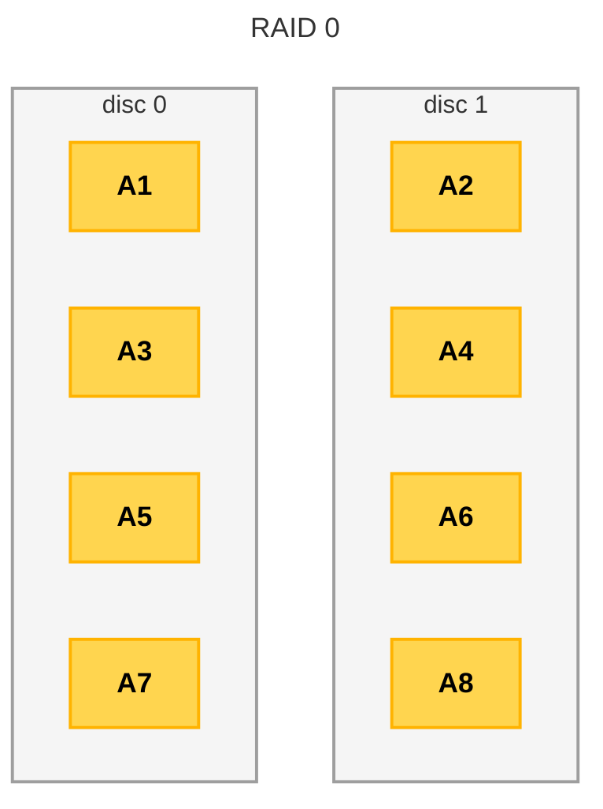
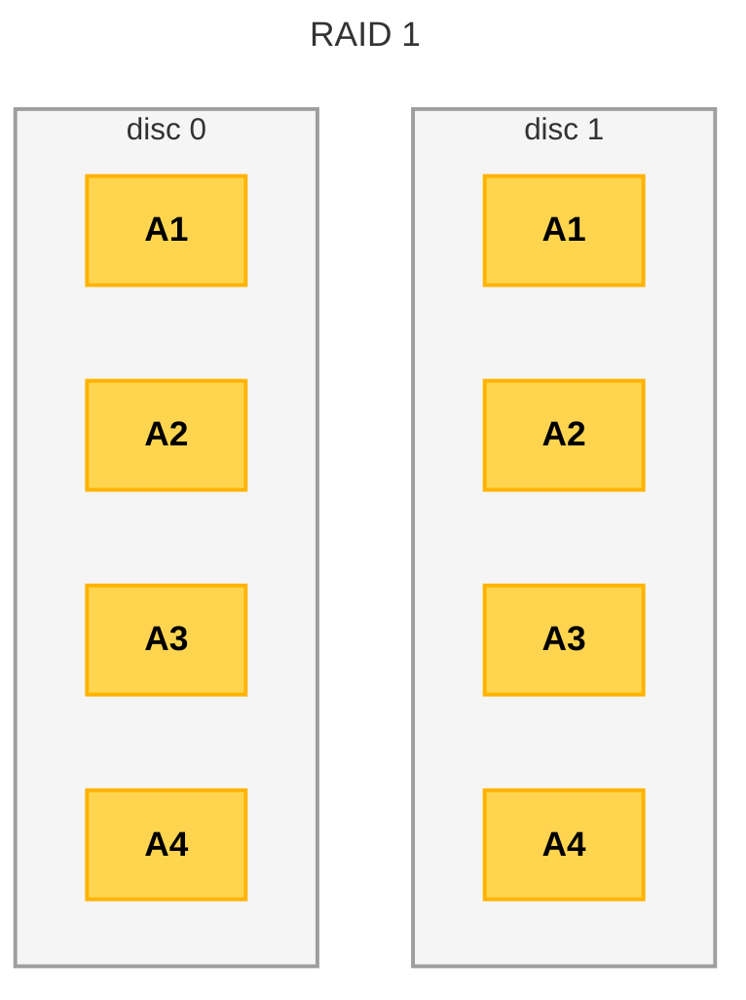
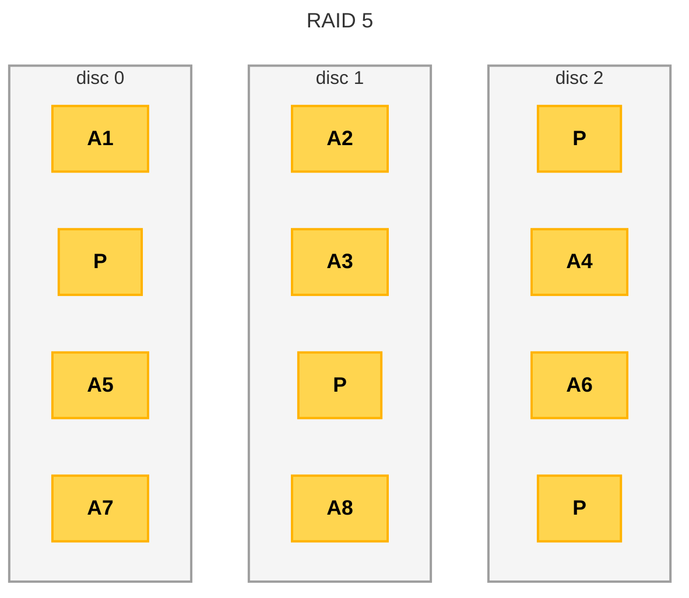
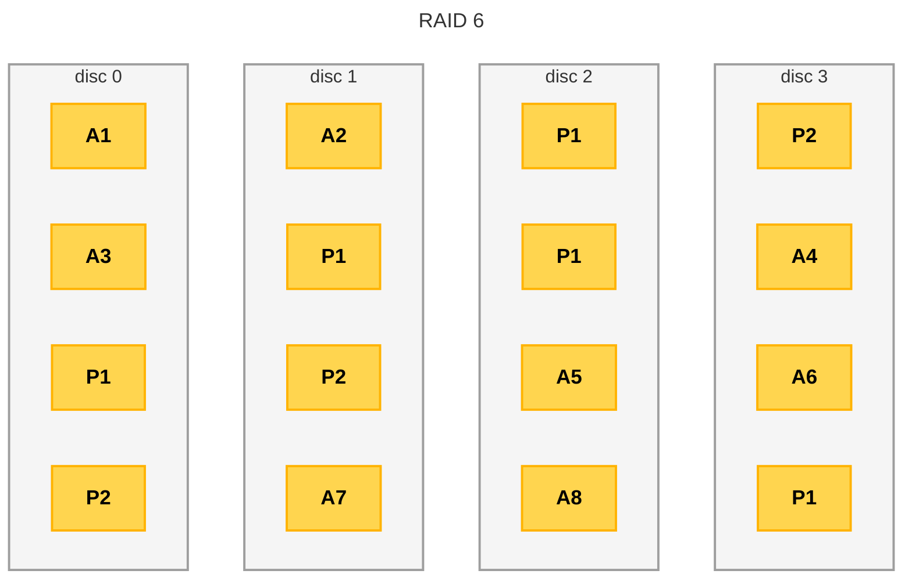
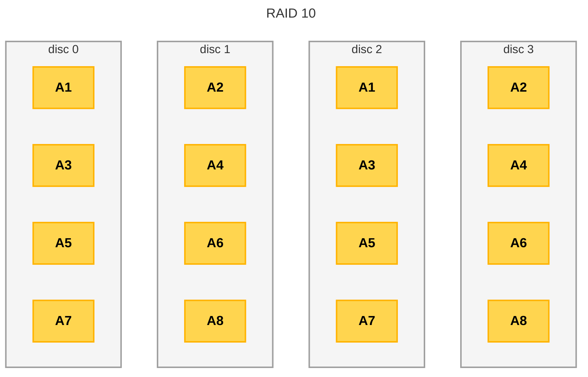
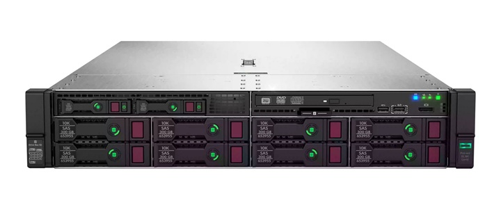
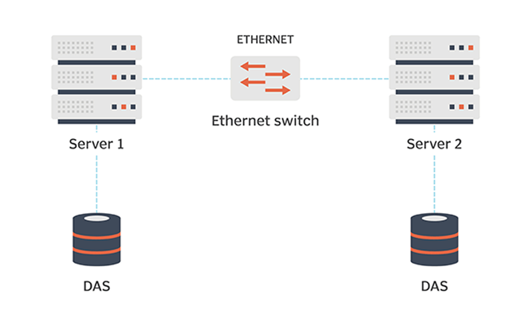
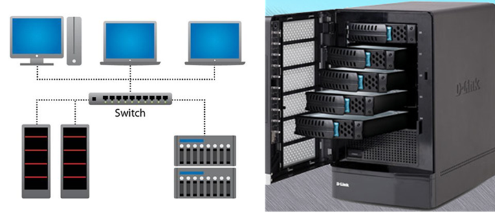
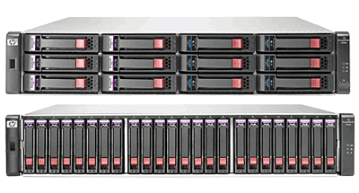
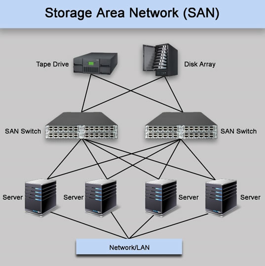

# AA2 Sistemes d'emmagatzematge

La informació (les dades) ha de ser guardada en medis persistents a l’equip:

- Disc durs (tecnologia magnètica)
- SSD (semiconductors)

També tenim sistemes externs (tercer nivell):

- Discos durs extraïble
- Pendrive
- Cintes magnètiques
- DVD

## Redundància

**Duplicar** la informació permet evitar la pèrdua d’aquesta davant una avaria de disc. Es pot implementar amb diferents tècniques que es combinen per disposar d'evitar un punt únic de fallada. Les tècniques més habituals són:

- RAID: redundant array of independent disks. És un sistema que permet combinar diverses unitats d’emmagatzematge en una sola unitat lògica. Es tracta de redundància **local** o a l'equip.

- Sistemes d'emmagatzematge en xarxa: que permeten tenir redundància a nivell de xarxa local (més d'un servidor o cabina). Evidentment, aquests sistemes en xarxa, a nivell d'equip usen RAID.

- Serveis de núvol: com Dropbox, Google Drive, OneDrive, etc. que permeten tenir la informació "duplicada" a Internet. És una solució molt atractiva, sobretot per a usuaris domèstics, però cal tenir en compte aspectes legals, de privacitat i també de velocitat de sincronització (no serà el mateix sincronitzar àlbums de fotos que la base de dades d'una empresa).

## RAID

**R**edundancy **A**rray of **I**ndependent **D**isks.

Sistema que combina diversos discos o unitats SSD de forma distribuïda. En funció del nivell de RAID s'obté:

- Tolerància a fallades: si un disc falla, la informació no es perd.
- Millora del rendiment: la informació es distribueix entre diversos discs, de manera que es poden llegir/escriure dades de forma paral·lela.

Els RAID es poden implementar amb hardware controladores i hardware específics que suporten les agrupacions de discos. És una solució que ofereix més rapidesa i, a més, aquest tipus de solucions suporten hot swap (intercanvi de disc sense aturar). Els sistemes operatius moderns també permeten implementar RAID amb software, però ofereixen un rendiment inferior i només permeten implentar les versions més bàsiques de RAID.

### Nivells de RAID

S’han dissenyat diversos nivells de RAID però a gran trets els actuals que s’utilitzen:

- Nivell 0: distribueix les dades (no redundant).
- Nivell 1: còpia exacta entre dos discos (mirror).
- Nivells 3,4,5,6: redundància, però per millorar aprofitament disc usen codis de paritat per recuperar informació.
- Nivells aniuats: es combinen diversos nivells (normalment amb el 0).

#### RAID 0

Anomenat Data Striping perquè distribueix la informació entre dos o més discos sense redundància. Augment rendiment perquè escrivim en els dos discos a l’hora.

### RAID 1

És un sistema en **mirall** (mirror) que duplica la informació entre dos discos. Replicació completa, però perdem capacitat a la meitat. Si un disc falla, l’altre conté la informació. La velocitat de lectura és ràpida i en escriptura és equivalent a la d’un sol disc, però més lent que RAID 0.

### RAID 5

Utilitza divisió de dades a nivell de bloc distribuint  la paritat entre tots els discos (mínim tres discos).
Implementació molt popular per oferir una redundància més econòmica i ràpida que RAID 1, es perd l'equivalent a un disc de capacitat, però requereix més discos i és més lent tant en escriptura com en lectura. Suporta la pèrdua d'un disc.

### RAID 6

Similar al RAID 5 però utilitza una segona banda de paritat, d'aquesta manera suporta la pèrdua de dos discs.Calen un mínim de quatre unitats.

### RAID aniuats (RAID 10)

Consisteix a combinar dos nivells de RAID, normalment RAID 1 i RAID 0. Es necessita un mínim de quatre unitats. La informació es distribueix entre dos conjunts de discs en mirall (RAID 1) i després es distribueix entre els conjunts (RAID 0). És una solució molt ràpida i segura, però cal tenir en compte que només es pot perdre un disc per cada conjunt de mirall.

Altres combinacions de RAID són possibles, però no són habituals. Per exemple, RAID 50 (RAID 5 + RAID 0) o RAID 60 (RAID 6 + RAID 0).

### Comparativa de nivells de RAID

A la següent taula teniu una comparativa dels nivells de RAID més habituals:

| Característica | RAID 0 | RAID 1 | RAID 5 | RAID 6 | RAID 10 |
| ---------------- | -------- | -------- | -------- | -------- | --------- |
| Nombre mínim de discs | 2 | 2 | 3 | 4 | 4 |
| Redundància | No | 1 disc | 1 disc | 2 discos | 1 disc |
| Capacitat utilizable | 100% | 50% | 1 disc | 2 discos | 50% |
| Velocitat de lectura | Alta | Alta | Baixa | Baixa | Alta |
| Velocitat d'escriptura | Alta | Mitjana | Baixa | Baixa | Mitjana |
| Cost | Baix | Alt | Alt | Molt Alt | Alt |

[Font: www.raid-calculator.com](https://www.raid-calculator.com/raid-types-reference.aspx)

## Sistemes d'emmagatzematge en xarxa

A un entorn empresarial les dades no haurien d’estar a les estacions de treball. Les dades centralitzades permeten evitar la inconsistència de les dades (quan un mateix arxiu o document està en diversos equips, però contenen versions diferents). A més, permeten fer còpies de seguretat de forma centralitzada i amb més facilitat.

Sistemes:

- Servidors d’arxius (direct attached storage)
- NAS (network attached storage)
- SAN (storage area network)

En el dispositiu que fa de servidor d’arxius s'usa la redundància RAID per disposar d'alta disponibilitat.

### DAS (Direct Attached Storage)

Bàsicament, servidors que exposen carpetes compartides (exemple xarxa escola). Usen protocols com SMB o NFS per compartir les carpetes. Pot ser tant bàsic com un servidor compartint unitats internes, com servidors amb cabines de discos dedicades a l’emmagatzematge amb hot-plug (intercanvi de disc sense aturar).

>Font: [HP](https://support.hpe.com/hpesc/public/docDisplay?docId=a00019684en_us&docLocale=en_US)

És la solució més senzilla però té alguns inconvenients:

- Si el servidor no és dedicat, el rendiment pot ser baix.
- Disponibilitat limitada, si el servidor falla, no hi ha accés a les dades.
- Coll d'ampolla a nivell de xarxa, si hi ha molts clients accedint al servidor alhora.

### NAS (Network Attached Storage)

Són dispositius dedicats a emmagatzematge en xarxa. Normalment són servidors amb un sistema operatiu especialitzat i amb una interfície web per a la seva gestió. Solucions molt aptes pel mercat domèstic i petites empreses. Són fàcils de configurar i d’usar, però tenen limitacions de rendiment (CPU i RAM limitades). A més la connexió de xarxa pot ser un coll d’ampolla si hi ha molts clients accedint al NAS alhora.

> Font:[DLink](https://www.dlink.com/en/products/nas)

### SAN (Storage Area Network)

Són xarxes d’emmagatzematge dedicades a l’emmagatzematge de dades. Són molt més complexes i costoses que les solucions NAS, però ofereixen un rendiment molt superior. S’usen en entorns empresarials amb grans volums de dades i amb necessitats de rendiment molt elevat. Són xarxes específiques que connecten servidors amb dispositius d’emmagatzematge (cabines de discos, cintes, etc.) i permeten que els servidors accedeixin als dispositius d’emmagatzematge com si fossin locals.

> Font: [infores](https://www.infores.es/productos/Almacenamiento-SAN.html)

Aquí podeu veure un exemple de hot-plug

Usen protocols com Fibre Channel, iSCSI, FCoE (Fibre Channel over Ethernet) que estan optimitzats per la transferència de fitxers, enfront dels protocols de xarxa habituals (TCP/IP) que estan optimitzats per a la transferència de paquets més petits. Això vol dir que els switchs no són els mateixos que els que es fan servir a la LAN i que els servidors han de tenir targetes de xarxa especials per connectar-se a la SAN, a més de les targetes convencionals per connectar-se a la LAN.

Permeten disposar d'alta disponibilitat, balanceig de càrrega i ofereixen un rendiment molt superior, però el seu cost és molt més elevat.

Per disposar d'alta disponibilitat, els servidors s'estructuren formant clusters, de manera que tenim no només redudància a nivell de disc (RAID) sinó també a nivell de servidor. Si un servidor falla, els altres servidors continuen donant accés a les dades.

> A una escala més petita podem muntar clúster d’emmagatzematge directament amb servidors a la LAN (DAS) amb tecnologies com Windows Server (DFS) o GlusterFS (Linux).

> Font: [What is Storage Area Network?](https://www.linkedin.com/pulse/what-storage-area-network-tamim-anwar/)

## Serveis de núvol

Utilitzar com sistema d’alta disponibilitat un servei al cloud. Pagament per ús enlloc d’usar infraestructura pròpia. Es pot usar fins i tot en entorn domèstic i amb plans gratuïts (per exemple, Google Drive ofereix 15 GB a qualsevol compte de Gmail). Permeten disposar de la informació a qualsevol lloc i en qualsevol moment, amb un cost més baix que la infraestructura pròpia, una disponobilitat molt alta, però cal tenir en compte que:

- Sincronització pot ser lenta, això pot ser especialment problemàtic si es treballa amb fitxers grans.
- Es perd el control complet de les dades: Seguretat de les dades? Què passa si el servei deixa de funcionar? Què passa si el servei tanca o canvia les condicions d’ús?
- Compliments legals (per exemple, la LOPD a Espanya o el RGPD a Europa) que obliguen complir una sèrie de requisites quan la informació inclogui dades de caràcter personal.
