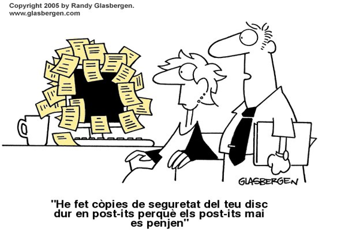
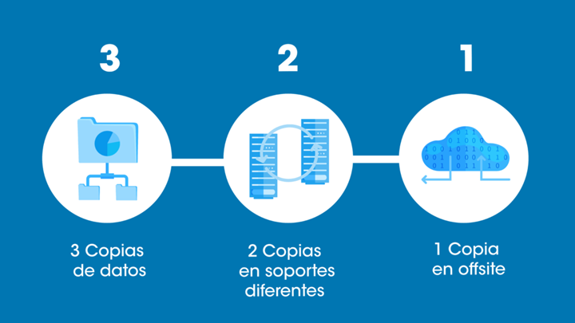
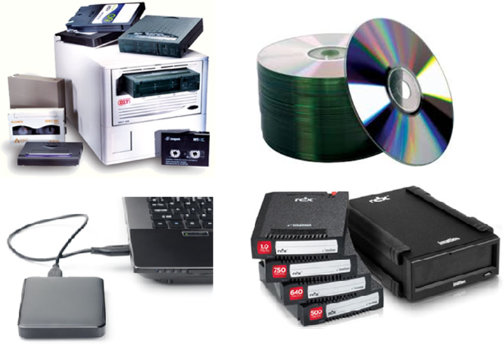
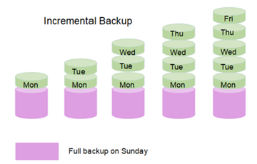
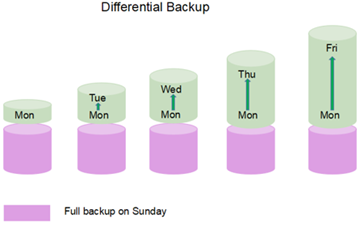
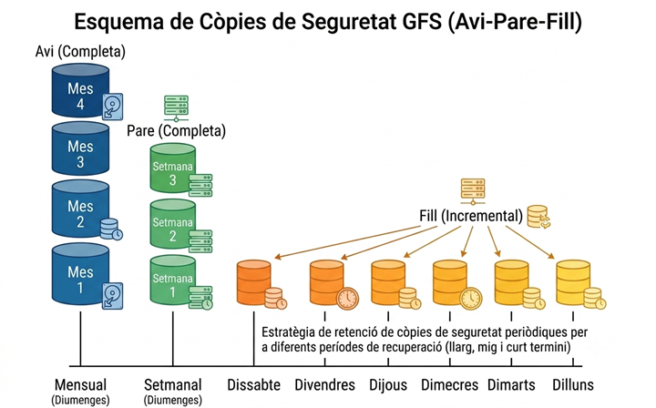
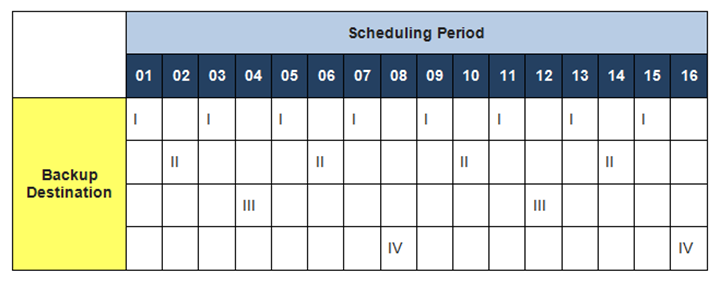
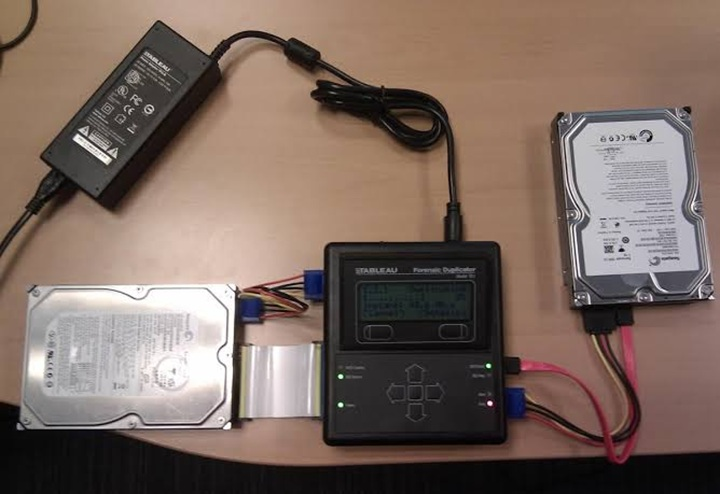

# AA3 Còpies de seguretat

## Introducció

Les dades presents a ordinadors, tant particulars com empresarials han de ser assegurades davant d’accidents, atacs informàtics o errors humans. Per això és necessari realitzar còpies de seguretat de la informació, que permetin recuperar-la en cas de pèrdua. Les motivacions per assegurar les dades poden ser:

- **Econòmiques**: la pèrdua de dades pot suposar un cost elevat per a l’empresa.
- **Legals**: diferents legislacions obliguen a guardar les dades durant un període de temps determinat. Per exemple: l'obligació guardar informació fiscal historials clínics 20 anys, la fiscal 5 anys, etc.
- **Sentimentals**: hi ha informació personal que tot i que no es pot valorar econòmicament, sí que es valuosa pels seus propietaris.

Si no disposem d’una còpia de les dades (backup), aquestes no es poden recuperar. Els sistemes d’alta disponibilitat com els RAID només protegeixen contra errors del hardware. No protegirà contra:

- Esborrats accidentals
- Atacs com el ransomware que xifren les dades.
- Modificacions del contingut no desitjades.

Hi ha tres conceptes que cal diferenciar a l'hora de parlar de fer còpies de seguretat:

- **Backup**: còpies de les dades amb l’objectiu de preservar-les i recuperar-les en cas de contingència.

- **Archiving**: emmagatzematge de dades per períodes de temps grans (anys), habitualment per qüestions legals o de funcionament de l’empresa. Aquestes emmagatzematge no permet una recuperació ràpida però garanteix la conservació a llarg termini.

-**Imatges del sistema**: còpia del sistema operatiu amb les aplicacions instal·lades a un equip. Això permet restaurar el sistema en cas de fallada del disc dur o d’un atac informàtic. Aquestes imatges no se centren a la informació, sinó a la recuperació ràpida del sistema (disaster recovery).

## Còpies de seguretat (backup)

**Definició**: Mesura de seguretat lògica i passiva que crea duplicats de les dades d'un sistema d'emmagatzemament per tornar a restaurar les dades en cas de desastre (incendi, fallada de discos, etc).

Les còpies de seguretat asseguren dos objectius de la seguretat de la informació:

- Integritat.
- Disponibilitat.

A l'hora de fer les còpies de seguretat cal tenir en compte els següents punts:

- Què volem protegir?
- On farem les còpies de seguretat?
- Quins dispositus utilitzarem per fer les còpies de seguretat?
- Amb quina freqüència farem les còpies de seguretat?
- Com farem les còpies de seguretat?
- Com farem comprovacions de les còpies de seguretat?
- Definir una política de còpies de seguretat.

### Qué volem protegir?

Totes les dades són importants però n’hi ha que en són més que les altres. Decidir quines dades són més importants és una tasca que cal fer abans de començar a fer còpies de seguretat i que implica conèixer el tipus de dades que es gestionen i la seva importància. Algunes dades poden ser fàcilment recuperables, mentre que d’altres poden ser irrecuperables.

Alguns exemples de dades importants:

- Documents usuaris
- Bases de dades
- Logs d’un servidor web

Fer còpies d'absolutament tot pot ser inviable per motius de cost i temps. Per això és important definir quines dades són crítiques i quines no.

### On farem les còpies de seguretat?

El següent punt és decidir on es faran les còpies de seguretat. Aquesta decisió és important ja que afectarà tant a la disponibilitat de les dades com a la seva seguretat.

Es poden plantejar fer còpies locals (en el mateix sistema), còpies remotes en xarxa, o còpies en el núvol. Cada opció té els seus avantatges i inconvenients.

#### Còpies locals

Es copia a un dispositiu local com un segon disc del propi equip o usant un dispostiu extern com un disc dur USB o una unitat de cinta. En el cas de la còpia a un segon disc, l'avantatge és que la còpia és molt ràpida i fàcil de recuperar. L’inconvenient és que si l'equip pateix un incident com un incendi, robatori o inundació, la còpia també es pot perdre, per tant, no és una solució recomanable com a única opció.

Per tant, sempre caldria fer una còpia a un dispositiu extern i guardar-lo en un lloc segur, com una caixa forta o una altra ubicació física.

#### Còpies remotes en xarxa

La còpia es realitza a través de la xarxa. Permet centralitzar les còpies de tots els equips. En instal·lacions grans (datacenters) és habitual disposar de robots de cintes, que permeten automatitzar les còpies de seguretat i emmagatzemar-les en cintes.

Si s’usa un servidor de fitxers específic és important limitar els permisos únicament a operadors de còpia per evitar accessos no autoritzats o atacs a través de la xarxa.

El punt dèbil d'aquesta opció és que la còpia es troba físicament a la mateixa ubicació que les dades originals, per tant, en cas d’incident com un incendi o inundació, es perden les còpies, com per exemple va passar amb l'incendi del datacenter d’OVH a Estrasburg el 2021 [enllaç a la notícia](https://www.datacenterdynamics.com/es/noticias/ovhcloud-condenado-a-pagar-250000-a-dos-clientes-que-perdieron-datos-en-el-incendio-del-centro-de-datos-de-estrasburgo/).

### Còpies remotes a Internet

Diverses empreses ofereixen fer les còpies de seguretat a Internet. Cal disposar d’una bona velocitat de connexió perquè les còpies completes poder ser molt lentes. A més cal tenir en compte una sèrie de factors com:

- Ubicació de les dades i compliment normatiu (RGPD, etc.).
- Redundància datacenter (tier) del proveïdor.
- Seguretat de les dades (xifrat, etc.).
- Continuïtat prestador? Què passa si l’empresa tanca o deixa de prestar el servei?

Els gegants del cloud Amazon, Microsoft i Google ofereixen serveis de còpia de seguretat a Internet. També hi ha altres moltes empreses que ofereixen serveis de còpia de seguretat a Internet com Backblaze, Acronis, Acens,etc.

> 💡 Quan toca moure un volum molt gran de dades cap un datacenter remot, a vegades és més ràpid els transport físc que no pas fer-ho a través d’Internet. Al següent [article](https://www.xataka.com/espacio/primera-foto-agujero-negro-supuso-5-petabytes-datos-fue-facil-enviarlos-avion-que-internet) s'explica un cas pràctic.
>
> Per exemple, AWS ofereix un servei de transport de dades físic amb discs durs anomenat [AWS Snowball](https://docs.aws.amazon.com/es_es/whitepapers/latest/how-aws-pricing-works/aws-snow-family.html).

#### Estratègia 3-2-1

El US-CERT va establir una recomanació a l'hora de fer còpies de seguretat anomenada "estratègia 3 2 1":

1. S'han de tenir **tres** còpies de les dades. Això vol dir l'original i dues còpies de seguretat.
2. Emmagatzemar les còpies en **dos** suports diferents, per exemple, cinta externa i servei de Internet.
3. Per últim, assegurem la separació física de les dades, tenint **una** còpia en una ubicació remota (backup offsite). El més habitual és emportar-se la còpia físicament a un altre edifici o enviar-ho a una unitat virtual al núvol.

> Font: [TECSENS](https://www.tecsens.com/regla-3-2-1-del-backup/)

D'aquesta manera, tenim garantim la redundància. Un incendi pot destruir les dades originals i la còpia local, però tenir còpia de seguretat al núvol significa que es tindrà una versió recent que no ha sofert el desastre.

### Dispositius per fer còpies de seguretat

Al final, les còpies de seguretat es fan sobre un suport físic. Els suports més habituals són:

- **Discs durs**: baix cost, bona relació preu capacitat, però problemes de fiabilitat i durada a llarg termini. Molt bona opció per a còpies d'accés ràpid (local o a una cabina de discos). En el cas de les unitats externes, és important tenir cura de cops i vibracions, ja que poden danyar el disc dur. Offline discs durs poden començar a degradar-se a partir de 10-15 anys aproximadament.

- **Unitats SSD**: més cares que els discs durs, però amb millor rendiment i fiabilitat (menys problemes amb les vibracions, cops, etc.). Han substituït els discs durs en molts sistemes d'emmagatzematge, però encara són més cares que els discs durs. Si són externs, cal tenir en compte que sense alimentació el contingut es comença a degradar a partir d'un any aproximadament, per tant, no és una opció adequada per a còpies de seguretat a llarg termini (archiving).

- **Dispositius òptics**: com CD, DVD o Blu-ray. Són més cars i la seva capacitat és més limitada. Tenen una durada més curta que les cintes (al voltant dels 20 anys en condicions òptimes). Són una bona opció per a còpies de seguretat petites i per a còpies immutables.

- **Unitats de cinta**: són més lentes que els discs durs, però són més duradores (uns 50 anys en condicions adequades) i fiables. Són una bona opció per a còpies de seguretat a llarg termini i per disposar de còpies immutables. Els models més habituals són LTO (Linear Tape-Open) i DLT (Digital Linear Tape). Cal tenir precaució amb condicions ambientals com alta humitat i temperatura, així com els camps magnètics, ja que poden danyar les cintes.

- **RDX**: és una tecnologia que utilitza discos durs o SSD extraïbles dins d’un cartutx protector. Combina els avantatges de les unitats de cinta amb la velocitat d'una unitat de disc. Són força més cars que les cintes.

### Freqüència de les còpies de seguretat

Cal establir la freqüència amb què es realitzaran les còpies de seguretat, aquesta freqüència ens marca la **finestra de recuperació** (recovery window) que és el temps màxim que podem perdre de dades. Per exemple, si fem còpies de seguretat cada 24 hores, en cas d’incident podem perdre fins a 24 hores de dades. Hi ha casos on 24 hores és un temps acceptable (pel volum de dades generat) i en altres casos no ho és. Per exemple, en un sistema de comerç electrònic, perdre 24 hores de dades pot suposar una pèrdua econòmica molt gran.

Per tant, establirem la freqüència de les còpies com un compromís entre la disponibilitat, el cost de fer les còpies tant en dispositius com en temps de personal i l'impacte en el negoci de fer les còpies (deixar d'usar l'equip o aturar serveis mentre es fan les còpies).

### Com fer les còpies de seguretat

Existeixen tres tipus o algoritmes de còpia de seguretat:

- **Còpia completa (full backup)**: es fa una còpia de totes les dades. És la més lenta i ocupa més espai, però és la més fàcil de restaurar.
- **Còpia incremental (incremental backup)**: només es copien les dades que han canviat des de l’última còpia de seguretat. És més ràpida i ocupa menys espai, però la restauració és més lenta ja que cal restaurar la còpia completa i totes les còpies incrementals posteriors.
- **Còpia diferencial (differential backup)**: només es copien les dades que han canviat des de l’última còpia completa. És més ràpida que la còpia completa i ocupa menys espai, però la restauració és més lenta que la còpia completa ja que cal restaurar la còpia completa i l’última còpia diferencial.

Les còpies incrementals i diferencials són útils perquè en no copiar totes les dades, es redueix el temps de còpia i l'espai necessari per emmagatzemar-les, això permet reduir l'impacte en el negoci, però necessiten l'existència de la còpia completa inicial, si aquesta còpia completa es perd, no es podrà recuperar la resta de còpies.

La còpia incremental és la més ràpida de fer, però la recuperació és més lenta perquè cal fer-la també de forma incremental, per tant, la còpia diferencial guanyaria en el temps de recuperació.

|Incremental                             |Diferencial                             |
|---                                     |---                                     |
| | |

> Font: [EaseUs](https://www.easeus.com/backup-utility/differential-backup-vs-incremental-backup.html)

**Quin tipus escollir?**

- **Completa**: Quan el volum de dades a copiar no és massa elevat és l'estratègia més senzilla i ràpida de restaurar, ja que només cal un arxiu per fer la restauració (<50 GB).

- **Diferencial**: Quan el volum de dades és molt elevat (>50 GB) però el volum de dades que s'ha modificat és poc elevat (<4 GB).

  - Partim sempre d'una còpia completa i després fem diferencials, al menys de forma diària.
  - Periòdicament fem una còpia total (per exemple cada setmana) i es torna a començar per que les dades a copiar van augmentant amb el temps.

- **Incremental**: Volum de dades molt elevat (>50 GB) i el volum de dades modificades és molt alt (>4 GB).

  - Partim de còpia completa i després fem les incrementals (potser més d'una vegada al dia).
  - Fem còpies completes més sovint (potser cada dia) per no tenir tantes incrementals, que dificulten la restauració i augmenten el risc.

I com es guarden les dades? Doncs bàsicament en un arxiu per còpia, això permet optimitzar l'espai (un arxiu únic ocupa menys espai que una estructura d'arxius i carpetes) i permet una millor gestió de les còpies. Per una optimització encara major de l'espai és habitual comprimir les dades abans de copiar l'arxiu al dispostiu (.ZIP, .BZ2, etc.), això permet reduir l'espai ocupat i el temps de còpia.

#### Esquemes de rotació de còpies de seguretat

En un sistema de còpies, les còpies antigues no són immediatament substituïdes per les noves, sinó que es van rotant. Això permet recuperar versions antigues de les dades en cas de necessitat. D'aquesta manera, tenim un **horitzó de recuperació** més ampli, ja que podem recuperar dades d'un període de temps més llarg.

> Exemple: descobrim que un treballador va modificar de forma indeguda un arxiu fa dos mesos. Si només tinguéssim la còpia de seguretat més recent, no podríem recuperar la versió anterior. En canvi, si tenim còpies de seguretat rotatives, podem recuperar la versió antiga.

A més, la rotació de les cintes permet un desgast més uniforme de les mateixes, ja que no s'utilitza sempre la mateixa cinta.

Hi ha diferents esquemes de rotació, però els més habituals són:

- **Grandfather-father-son (GFS)**: és l'esquema més habitual, perquè és força senzill i permet recuperar dades d'un període de temps llarg.

- **Tower of Hanoi**: és un esquema més complex que permet optimitar l'ús de cintes (o discos), però per contra, la seva complexitat fa que sigui recomanable usar sistemes guiats o automàtitzats per evitar errors.

#### Esquema Grandfather-father-son (GFS)

L'esquema és el següent:

- Cada setmana, per exemple els dissabtes o diumenges, es fa una còpia completa (full backup) i s'emmagatzema com a còpia "pare" (father). S'utilitza una cinta per cada setmana (S1, S2, S3, S4 i S5 pels mesos de 5 setmanes).

- Cada dia de la setmana es fa una còpia incremental o diferencial (segons el volum de dades) i s'emmagatzema com a còpia "fill" (son). Hi ha una cinta per cada dia de la setmana i es van reutilitzant cada setmana. Quan s'omple la cinta, es poden eliminar les còpies més antigues.

- Cada mes, la darrera còpia completa del mes s'emmagatzema com a còpia "avi" (grandfather) i s'extreu la cinta de l'esquema de rotació setmanal.

La darrera còpia mensual es converteix a la còpia anual que habitualment s'emmagatzema a llarg termini (archiving) molt habitualment en ubicacions específiques i fora de l'organització.

> Font: Imatge creada usant IA.

#### Torres de Hanoi

Model basat a l’estratègia del conegut joc. L'objectiu és tenir la màxima cobertura amb el mínim nombre de cintes. Habitualment s’utilitza amb sistemes automàtics de gestió de cintes per minimitzar els errors a l’hora de seleccionar la cinta. Cada dispositiu o conjunt de suports (etiquetats com a A, B, C, D...) s'utilitza amb una freqüència que es duplica amb cada nova lletra.

Per exemple, amb un esquema de quatre unitats:

- La unitat A s’utilitza en dies alterns.
- La unitat B s’utilitza cada quatre dies.
- La unitat C s’utilitza cada vuit dies.
- La unitat D s’utilitza cada setze dies.

En aquest esquema A i B són les unitats més utilitzades i habitualment es fan còpies incrementals o diferencials, mentre que C i D s’utilitzen per a còpies completes. De tota manera, si el volum de dades no és molt elevat, es recomana que totes les còpies siguin completes, ja que això simplifica la restauració de les dades.

Igual que en l'esquema GFS, les còpies mensuals es poden extreure de l'esquema de rotació i l'anual enviar-se a archiving.

> Font: [Handy Backup](https://www.handybackup.net/tower-of-hanoi-backup.shtml)

### Com comprovar les còpies de seguretat

Si el sistema de còpies falla, no podrem restaurar les dades. Cal fer comprovacions periòdiques i proves de restauració per comprovar que tot funciona correctament.

> ❗Al 1998 Pixar va perdre 90 minuts de pel·lícula de Toy Story 2 per un error en el sistema de còpies de seguretat, per sort una treballadora disposava d'una còpia de les dades al seu equip. [Enllaç a la notícia](https://www.redstor.com/resource-hub/five-of-the-biggest-scare-stories-in-data-backup-history/)

A més, aquestes comprovacions periòdiques permeten entrenar al personal en la restauració de les dades, ja que en cas d’incident, el temps de recuperació és crític i cal evitar errors que puguin empitjorar la situació. Per això és recomanable establir un calendari de proves de restauració, on es comprovi que les còpies es poden restaurar correctament i en el temps previst.

> 💡 Si cal restaurar una arxiu de base de dades, és molt recomanable no sobreesciure les dades existents, d'aquesta manera es poden comparar les dues versions i si és necessari combinar-les.

### Política de còpies de seguretat

És establir un conjunt de normes i procediments que defineixen com es realitzen les còpies de seguretat, amb quina freqüència, on es guarden, com es comproven i com es restauren. Aquesta política ha de ser coneguda per tot el personal implicat en la gestió de les dades i ha de ser revisada periòdicament per assegurar que segueix sent adequada a les necessitats de l'organització.

Això vol dir que a més de definir els aspectes ja explicats: de què fem còpies, a on, com i quan, també cal definir altres aspectes com:

- Responsables de les còpies de seguretat.
- Temps de retenció de les còpies de seguretat.
- Procediments de restauració de les còpies de seguretat.
- On es guarden les còpies de seguretat.
- Com es protegeixen les còpies de seguretat.
- Renovació dels suports (no podem esperar a que fallin) i destrucció segura.

### Protecció de les còpies de seguretat

Si algú roba les còpies bé físicament o accedint per exemple al servidor a Internet, té accés a totes les dades. La solució és xifrar les dades. El tema del xifrat el veurem més endavant, però bàsicament són mecanismes que permeten codificar les dades de manera que només es puguin llegir amb una clau secreta. Això permet que encara que algú accedeixi a les còpies, no pugui llegir-les sense autorització. Pràcticament tots els programes de còpia de seguretat permeten xifrar les dades abans de fer la còpia.

Les unitats (cinta, disc, etc.) on es fan les còpies de seguretat també s’han de protegir físicament, tant contra accessos no autoritzats com contra incendis, per exemple amb armaris ignífugs.

Les còpies de llarg termini (archiving) s’han de guardar en ubicacions especials, amb condicions ambientals controlades i amb accés restringit. Per exemple, [Iron Mountain](https://www.ironmountain.com/es-es/services/offsite-tape-vaulting) ofereix serveis d’emmagatzematge de dades a llarg termini amb aquestes característiques.

### Renovació dels suports i destrucció segura

Els suports físics on es guarden les còpies de seguretat tenen una vida útil limitada, en funció de l'ús (número de lectures i escriptures), de les condicions ambientals i del temps, el suport pot acabar fallant. Per això és important establir un calendari de renovació dels suports, on anem substituint els suports antics per nous abans que fallin. Això permet assegurar la integritat de les còpies de seguretat i evitar pèrdues de dades.

I què fem amb els suports descartats? No podem llençar-los a les escombraries, ja que poden contenir informació sensible. Cal **destruir-los de manera segura**, amb els mecanismes i mètodes que vam veure a la unitat [AA1-Protegint les dades](./AA1-ProtegintDades.md). Per exemple, triturar els discs durs o les cintes, desmagnetitzar-los o utilitzar serveis especialitzats de destrucció de dades.

### Programes de còpia de seguretat

A Windows tenim diverses opcions tant natives del sistema com de tercers:

- Còpia seguretat Windows: té l’avantatge de crear fitxers VHD però prestacions limitades a nivell d’esquemes.
- Cobian i similars: útils per equips individuals o petits servidors. Solen ser gratuïts per ús domèstic.
- Acronis Backup i similars: solucions professionals per xarxa i servidors.

A Linux també tenim moltes opcions:

- tar: comanda per empaquetar que és molt flexible i combinat amb cron es pot programar.
- Rsync: backup remot per línia de comandes.
- Duplicity: backup local i remot per línia de comandes.
- Areca Backup: Amb interfície gràfica pensada per equips individuals.
- Acronis: és una solució de pagament per servidors.

## Imatges restauració del sistema

És un arxiu o dispositiu que conté l’estructura i continguts complets d’un dispositiu o mitjà d’emmagatzemament de dades. Permet restaurar tot el sistema: sistema operatiu, aplicacions i configuracions.

Es diferencia de les còpies de backup en que no hi ha necessitat de fer còpies tant freqüents (el sistema només varia en fer actualitzacions). Per exemple, el sistema operatiu base amb les aplicacions instal·lades i que l'objectiu no són les dades.

Permeten estalvi de temps. Exemple: Instal·lar el SO en un equip, drivers del dispositius, istal·lar i configurartotes les aplicacions, es pot trigar de una a vàries hores. En restaurar des d'una imatge, el temps s'escurça a uns minuts.

### Casos d'ús

- **Clonació de discs durs**: consisteixa en replicar els continguts en un altre equip. Es copia el contingut del disc (no els blocs del disc considerats "esborrats" o lliures), per això, la imatge pot ocupar menys de la capacitat del disc.

- **Imatges de disc**: similar a la clonació, però aquí es crea un fitxer de destí amb tots els continguts i el destí serà no el destí final, sinó una unitat de "respaldament". L'arxiu de destí es pot comprimir per ocupar menys espai.

- **Imatges forenses**: Aquí cal copiar **tots** el contingut de la unitat (còpia bloc a bloc) i es genera un arxiu amb tot el contingut, inclòs l'espai no usat. Es calcula el hash per verificar la integritat de l’arxiu imatge (preservar proves). Aquestes imatges s'utilitzen en investigacions o peritatges i s'usen eines específiques com  o clonadores físiques.

### Eines per crear imatges del sistema

En sistemes Windows tenim l'eina [nativa](https://somebooks.es/crear-una-imagen-de-disco-en-windows-11/) per crear imatges del sistema, però també hi ha eines de tercer com [Acronis True Image](https://www.acronis.com/es/products/true-image/), [Clonezilla](https://clonezilla.org/) o [Fog](https://www.fogproject.org/).

A Linux a part de Clonezilla, tenima la comanda `dd` que permet fer una còpia bit a bit d'un dispositiu d'emmagatzematge. També hi ha eines com [PartImage](https://www.partimage.org).

Quan el cal és fer imatges forenses, hi ha eines com [FTK Imager](https://accessdata.com/product-download/ftk-imager-version-4-5-0) o [Guymager](https://guymager.sourceforge.io/).

## Enllaços d'interès

- [INCIBE. Guía de copias de seguridad](https://www.incibe.es/index.php/empresas/guias/copias-seguridad-guia-aproximacion-el-empresario)

- [Backup Types Explained: Full, Incremental, and Differential (NAKIVO Team)](https://www.nakivo.com/blog/backup-types-explained/)

- [IONOS. Los mejores pro­vee­do­res de copias de seguridad en la nube](https://www.ionos.com/es-us/digitalguide/servidores/herramientas/programas-para-backups-online/)

- [Somebooks. Clonezilla: Crear una imagen del equipo paso a paso](https://somebooks.es/clonezilla-crear-una-imagen-del-equipo-paso-paso/)

- [David Casas. YouTube: Clonando discos NIVEL FORENSE con clonadora HARDWARE](https://youtu.be/etG6uFN4Gfk?si=dqxUvoOQYMxAG_k_)
