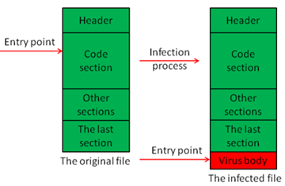

# AA1. Malware

## Introducció

Podem pensar en els sistemes informàtics com a sistemes vius, i com aquests, poden patir malalties. En el cas dels sistemes informàtics, aquestes malalties són **ciberatacs** provocats per programes maliciosos que poden afectar el seu funcionament i comprometre la seguretat de les dades. Aquests programes maliciosos, es coneixen com a **malware** i són una de les principals amenaces per a la seguretat dels sistemes informàtics i existeixen diferents tipus atenent a la seva forma de propagació i a la seva finalitat.

I quins objectius tenen aquests programes maliciosos? Doncs, poden tenir diferents objectius, com ara robar informació confidencial, controlar el sistema afectat, mostrar publicitat no desitjada, destruir dades o simplement causar danys al sistema.

## Classificació del malware

El malware es pot classificar segons el seu comportament principal. Un malware en concret pot no ajustar-se a una sola categoria perquè els programadors de malware combinen diverses tècniques per tenir més èxit en els seus atacs. En aquesta [guia](https://www.incibe.es/ciudadania/blog/os-presentamos-la-nueva-guia-sobre-ciberataques) publicada per l'INCIBE, es poden veure els diferents tipus de malware i com es propaguen.

### Virus

Un virus és un programa maliciós que s'injecta en un altre programa legítim i es propaga quan aquest programa és executat (per això se'l denomina virus). Els blancs són tipus d'arxius que es puguin executar: executables, documents amb macros o sectors d'arrencada d'unitats. Els virus poden tenir diferents efectes, com ara eliminar fitxers, robar informació o mostrar missatges no desitjats. propagació.

### Cucs

Un cuc és un programa maliciós que es propaga automàticament a través de xarxes informàtiques, sense necessitat d'interacció de l'usuari. A diferència dels virus, els cucs no necessiten infectar un altre programa per propagar-se. Poden explotar vulnerabilitats en el sistema operatiu o en aplicacions per infectar altres dispositius connectats a la mateixa xarxa. Els cucs poden causar congestió de xarxa i consumir recursos del sistema, provocant una disminució del rendiment a més són el vehicle per propagar altres tipus de malware, com ara troians o ransomware a través de la xarxa.

> ❗Stuxnet és un exemple de malware compost que va afectar les centrals nuclears iranianes el 2010. Aquest malware es va propagar inicialment a través d'unitats USB infectades.  Posteriorment, es va propagar a través de la xarxa local (comportament de cuc) fins arribar a un equipament concret crític pel procés d'enriquiment d'urani. Un cop arribava aquest equipament, el payload (càrrega danyina) començava a actuar, causant danys al sistema. Aquest atac va ser un dels primers exemples de ciberatac amb finalitats polítiques i militars.

### Troians

Un troià, realment "trojan horse", és un programa maliciós que es fa passar per un programa legítim o útil per enganyar l'usuari i aconseguir que l'executi. Un cop executat, el troià pot realitzar accions malicioses com robar informació, controlar el sistema o instal·lar altres tipus de malware. A diferència dels virus i els cucs, els troians no es propaguen automàticament, sinó que depenen de l'engany de l'usuari per ser instal·lats.

### Backdoors i rootkits

Un backdoor és un tipus de malware que permet a un atacant accedir a un sistema informàtic de manera remota i sense autorització. Els backdoors poden ser instal·lats per altres tipus de malware, com troians, o poden ser creats per desenvolupadors amb intencions malicioses. Un cop instal·lat, el backdoor permet a l'atacant controlar el sistema, robar informació o instal·lar altres tipus de malware.

> Els smartphones s'han convertit en un objectiu molt popular d'aquest tipus de malware, sovint amb actors governamentals darrere. Un exemple és el malware **Pegasus**, que s'ha utilitzat per espiar periodistes, activistes i polítics a tot el món. Aquest malware s'instal·la en els dispositius mòbils i permet als atacants accedir a missatges, correus electrònics, trucades i altres dades sensibles.

Un rootkit és un tipus de malware que s'oculta dins del sistema operatiu i permet a un atacant mantenir l'accés al sistema sense ser detectat. Els rootkits poden modificar el nucli del sistema operatiu, amagar processos i fitxers, i interceptar trucades al sistema per evitar la detecció. Són especialment perillosos perquè poden permetre a un atacant mantenir el control del sistema durant molt de temps sense ser detectat.

La diferència principal entre un rootkit i un backdoor (porta del darrera) rau en el seu objectiu primordial: el rootkit se centra a ocultar la seva presència i mantenir el control de màxim nivell (privilegis d'administrador) modificant el sistema operatiu, mentre que un backdoor busca proporcionar un mètode alternatiu d'accés remot sense passar per l'autenticació estàndard.

### Bomba lògica

Part d’un malware que s’encarrega de fer una acció destructiva quan es compleixen determinades condicions (data, acció usuari, etc.) Pròpiament no és un malware en sí mateix, sinó una part d'un malware més complex. En el cas de Stuxnet, la bomba lògica era la part del malware que s'activava quan detectava que el sistema infectat era un controlador de centrifugadores d'enriquiment d'urani, provocava un funcionament incorrecte de les centrifugadores fins provocar una avaria.

### Spyware i adware

El spyware (programa espia) és tot programa que recol·lecta  i envia informació dels usuaris. Els **keylogger** són exemples de spyware que envien les pulsacions del teclat a un servidor remot. Són especialment perillosos perquè poden robar contrasenyes i informació sensible.

Adware és un programari no desitjat dissenyat per mostrar anuncis molestos, recopilar dades de navegació i, en molts casos, redirigir el trànsit per generar ingressos il·lícits.

### Ransomware

Malware que segresta la informació del sistema (xifrant-la) i on els delinqüents exigeixen un rescat per recuperar-la. Té un impacte catastròfic en les organitzacions, sobretot si no hi ha disponibles còpies de seguretat, bé perquè no s'han fet còpies de seguretat o bé perquè les còpies de seguretat també han estat xifrades.

> ❗WannaCry (2017):L'atac de ransomware més devastador de la història. Va infectar més de 230.000 ordinadors de 150 països. Va paralitzar empreses, institucions i serveis públics arreu del planeta.

És el tipus de malware més popular avui dia, ja que permet obtenir grans beneficis econòmics per part dels atacants, movent milers de milions de dòlars.

> 💡Actualment existeix tota una indústria del cibercrim darrere del ransomware. Existint grups que creen les eines i afilitats que les exploten a canvi d'un pagament.

## Eines antimalware

Eines dissenyades per a detectar diferents tipus de malware que poden residir als equips informàtics i actuar per evitar la seva activació (esborrar o posar en quarantena). Popularment conegudes com a **antivirus**, tot i que avui dia el seu abast és molt més ampli, ja que poden detectar i eliminar diferents tipus de malware, com ara virus, cucs, troians, spyware, adware i ransomware.

Bàsicament presenten dos modes de protecció:

- **Protecció en temps real**: supervisa constantment el sistema per detectar i bloquejar qualsevol activitat sospitosa abans que pugui causar danys.
- **Anàlisi sota demanda**: permet a l'usuari escanejar el sistema manualment per detectar i eliminar malware que ja hagi estat instal·lat.

Els programes antimalware utilitzen diferents tècniques per detectar malware:

- **Signatures de virus i malware**: es cerquen en els arxius cadenes binaries característiques d’un malware. El malware s’intenta camuflar usant el polimorfisme de manera que canvia el codi (signatura) però no l’efecte.
- **Heurística**: intenta detectar el malware a partir d’un comportament sospitós (obrir connexions de xarxa, cridar determinades funcions del SO, etc.)
- **Sandbox**: executar els programes sospitosos en un entorn aïllat per mitigar efecte i detectar les accions.
- **Registre de hash dels fitxers del sistema**: per detectar canvis no autoritzats.

En organitzacions grans, és habitual disposar d’un sistema centralitzat de protecció antimalware que permet gestionar i monitoritzar tots els equips de l’organització. Aquestes solucions anomenades XDR/SIEM (Extended Detection and Response / Security Information and Event Management) permeten detectar i respondre a amenaces tant de els equips finals, com a la xarxa o al correu electrònic. A més, permeten correlacionar esdeveniments i generar alertes per a una resposta més ràpida i eficaç davant d'incidents de seguretat. Estan formades pel SIEM que actua com a centre de control i per un conjunt d'eines de detecció i resposta (XDR) que poden incloure antimalware, IDS/IPS, EDR (Endpoint Detection and Response), entre altres.

## Eines online de detecció de malware

Existeixen recursos a Internet per a poder comprovar si un fitxer o executable conté malware.
Serveix per detectar malware, les mostres s’utilitzen per actualitzar els motors de detecció.

Plataformes:

- **VIRUSTOTAL**: <https://www.virustotal.com>
- **MetaDefender**: <https://www.metadefender.com>
- **VirScan**: <http://www.virscan.org/>
- **Jotti**: <https://virusscan.jotti.org/>
- **AndroTotal** (Android): <https://www.andrototal.org/>
