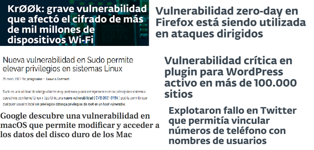
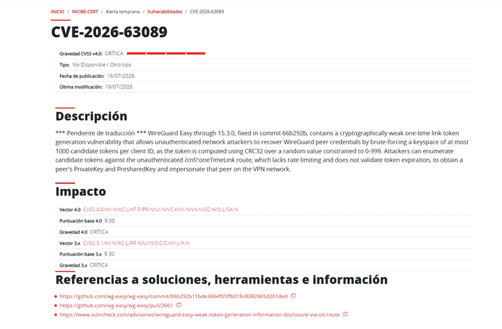
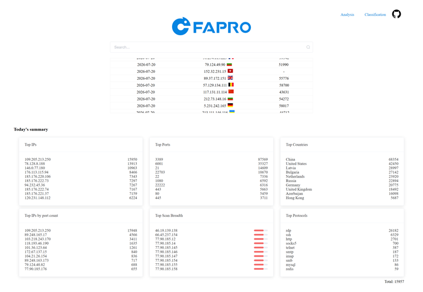

# AA2. Vulnerabilitats

## Introducció

Les **amenaces** són aquelles accions externes que afecten la seguretat dels nostres sistemes. No sempre són atacs intencionats, si no que també cal considerar accidents o errors humans.

Aquestes amenaces exploten **vulnerabilitats** que són factors interns febles o defectes, que debiliten la seguretat d’un sistema informàtic.

La combinació de les vulnerabilitats amb les amenaces o atacs, determina el **risc** que té un sistema informàtic.

## Amenaces

Les amenaces (threads) es poden classificar en funció del tipus, però també segons el risc que representa i de les accions que s’han de realitzar per mitigar-lo. Afecten a un o més principis de la seguretat informàtica:

| Princ. seguretat | Amenaces                                 |
|------------------|----------------------------              |
| C                |Intercepció, Fabricació                   |
| I                | Interrupció, Modificació, Fabricació     |
| D                | Interrupció, Intercepció, Modificació    |

- **Interrupció**: Un recurs del sistema o de la xarxa deixa d'estar disponible.

- **Intercepció**: Un intrús accedeix a la informació del nostre equip o a la que enviem per la xarxa.

- **Modificació**: La informació ha estat modificada sense autorització (ja no és vàlida).

- **Fabricació**: Es crea un producte fals (exemple: pàgina web) per tal de robar informació

Bona part de les amenaces es basen en hàbits poc segurs per part dels usuaris:

- Usar comptes d’administrador pel treball diari.
- Obrir enllaços poc fiables.
- Connectar pendrives desconeguts a l’equip.
- No actualitzar els programes i el SO.

Altres vulnerabilitats afecten directament al SO o les aplicacions tant de client com de servidors o a la pròpia infraestructura (hardware).

## Vulnerabilitats

Error en un sistema que permet violar la política de seguretat definida. Les vulnerabilitats poden ser físiques o més habitualment dels SO o dels programes utilitzats.

> ❗Quan una vulnerabilitat encara no ha estat reportada, s’anomena de **0-day** (zero-day) i és especialment perillosa, ja que no existeix cap solució ni actualització que la corregeixi.

Cal tenir una política proactiva, per detectar les vulnerabilitats dels nostres sistemes:

- Polítiques actualització de SO, aplicacions, firmware, etc.
- Estar informat de les vulnerabilitats.
- Utilitzar escàners de vulnerabilitats

### Registre de vulnerabilitats

Serveis com [INCIBE-CERT](https://www.incibe.es/incibe-cert) "Centre de resposta a incidents de seguretat de l'empresa i ciutadania" publiquen avisos sobre les vulnerabilitats detectades, indicant les característiques i les mesures de mitigació.

I com s'identifiquen les vulnerabilitats? Existeixen diverses bases de dades que cataloguen les vulnerabilitats detectades, però una de les més populars és la base de dades [CVE-Mitre](https://cve.mitre.org/) (Common Vulnerabilities and Exposures) que assigna un identificador únic a cada vulnerabilitat coneguda amb el format CVE-YYYY-NNNNN, on YYYY és l'any de publicació i NNNNN és un número seqüencial. Però n'hi ha d'altres com CNVD o OWASP.

Una vulnerabilitat es classifica per la seva gravetat (severity) "Low", "Medium", "High" o "Critical" i segons el sistema CVSS (Common Vulnerability Scoring System) que assigna un valor numèric de 0 a 10, on 0 és una vulnerabilitat sense impacte i 10 és una vulnerabilitat crítica.

> ℹ️Score (puntuació): és un número de 0,0 a 10,0. Es calcula tècnicament avaluant variables fixes com la dificultat d'explotar el defecte, si requereix privilegis o l'impacte real en la confidencialitat i integritat del sistema.
>
>Gravetat: És una etiqueta de text (Baix, Mitjà, Alt o Crític). Ajuda als equips humans a entendre ràpidament la urgència del problema sense haver d'analitzar els decimals de l'algorisme.

Existeixen múltiples webs on es poden obtenir la relació de les vulnerabilitats i del seu impacte:

- Afectació
- Gravetat
- Mitigació o solució

Algunes webs de consulta:

- <http://web.nvd.nist.gov/view/vuln/>
- <http://www.cvedetails.com/>
- <https://www.incibe.es/incibe-cert/>

### Eines de detecció de vulnerabilitats

Existeixen diverses eines que permeten explorar els sistemes tant en local, com en xarxa per detectar vulnerabilitats:

- Metasploit: una de les més populars perquè a més permet llençar els exploits.
- Nessus: scanner de vulnerabilitats per sistemes en xarxa.
- OpenVas: deriva de Nessus i és open source.
- Vera: eina per detectar vulnerabilitats per serveis web.

> 💡Amb l'utilització massiva de la intel·ligència artificial, la seguretat no es podia quedar enrere i actualment, s'utilitzen model d'IA per la detecció de vulnerabilitats, un dels més coneguts és Claude Mythos d'Anthropic que ha detectat múltiples vulnerabilitats, algunes de les quals existien des de fa molt anys. [Enllaç a article sobre Claude Mythos](https://www.xataka.com.mx/seguridad/mythos-anthropic-puede-encontrar-vulnerabilidades-cualquier-software-acaban-descubrir-que-tambien-puede-explotar-cuestion-horas)

### Risc i impacte

Ara bé, no totes les vulnerabilitats són igual de perilloses, ni poden ser explotades amb la mateixa facilitat, ni provocar el mateix nivell de dany, per això s'avaluen usant dos paràmetres: el **risc** i l'**impacte**.

El **risc** és la probabilitat o possibilitat que una amenaça aprofiti una debilitat (vulnerabilitat) i causi un problema. Respon a la pregunta: Quina probabilitat hi ha que ens ataquin o que fallem?

L'**impacte** és la mida del dany o la pèrdua (econòmica, reputacional o legal) que patiria l'organització si l'incident finalment es passés. Respon a la pregunta: Si l'atac té èxit, quant ens costarà o quant de mal ens farà?

Es relacionen mitjançant una fórmula bàsica: $Risc = Probabilitat × Impacte$.

El risc total d'una empresa depèn directament de l'impacte. Un esdeveniment pot tenir un impacte catastròfic, però si la probabilitat que passi és gairebé zero, el risc global es considera baix. La ciberseguretat busca reduir tots dos factors.

Veiem-lo amb un exemple senzill:

L'ordinador de recepció d'una clínica el fa servir el recepcionista d'una clínica mèdica, el qual té una vulnerabilitat (no té contrasenya d'accés).

L'Impacte és **ALT**: Si algú entra a l'ordinador, pot robar l'historial mèdic confidencial dels pacients. Això provocaria demandes legals, multes de protecció de dades molt cares i pèrdua de prestigi.

El Risc depèn de la situació:

- Cas A (Risc Alt): L'ordinador està a la vista de tothom, a la línia de passadís i el recepcionista s'aixeca sovint. La probabilitat que algú s'hi acosti i toqui l'ordinador és molt alta.
- Cas B (Risc Baix): L'ordinador està dins d'un despatx tancat amb clau on només hi entra personal autoritzat. La probabilitat que un desconegut hi accedeixi és molt baixa. L'impacte continua sent el mateix (les dades són igual de crítiques), de manera que el risc total disminueix perquè la probabilitat és mínima.

## Exploits

Les vulnerabilitats poden ser aprofitades pels atacants mitjançant **exploits** per aconseguir l’accés. Els exploits poden ser:

- **locals**: si cal tenir accés físic a la màquina.
- **remots**: si l’atac es pot fer a través de la xarxa.

De la mateixa manera que disposem de les llistes de vulnerabilitats, també es poden trobar a Internet tota una sèrie de llocs web que contenen bases de dades d'exploits, per aprofitar-se de les vulnerabilitats que es van descobrint.

La més popular actualment és [exploitDB](https://www.exploit-db.com/) però se'n poden trobar moltes més i repositoris de codi obert com GitHub, on els desenvolupadors comparteixen els seus scripts i eines d'explotació.

Els **pentests** (penetration tests), són proves de penetració, atacs a un sistema o organització, amb l’objectiu de trobar-hi vulnerabilitats.

La intenció d’aquestes proves és determinar la viabilitat d’un atac i l’impacte en el negoci que podria tenir i aquesta vulnerabilitat fos explotada.

> A [PentesterLab](https://www.pentesterlab.com/) teniu exercicis (alguns gratuïts) per aprendre diverses tècniques de pentesting.

## Eines de detecció d'intrusions

Però, i si malgrat tot, patim una intrusió? Existeixen eines per mirar de detectar les intrusions i fins i tot, combatre l’atacant.

### Inspecció de logs

Revisió dels logs dels sistemes, ja que allà queda registrada l’activitat. Cal configurar quines accions volen que quedin registrades. Els atacants solen intentar esborrar aquests logs per eliminar el seu rastre, però ja això indica que hi ha hagut un atac.

La inspecció de logs no ens protegeix d'un atac, però sí ens permet determinar que s'ha patit un, i sobre tot, com ha estat realitzat. Això ens permetrà prendre mesures per evitar que torni a passar.

### IDS/IPS

Intrusion Detection Systems (IDS) i Intrusion Prevention Systems (IPS) són elements de protecció de la xarxa (NIDS) o dels equips (HIDS).

Els IDS/IPS comparen els paquets de xarxa amb una base de dades de ciberatacs per detectar signatures sospitoses. Els IDS generen una alerta davant un positiu mentre que els IPS fan accions com denegar el trànsit, bloquejar la connexió, etc. N’hi ha per protegir equips concrets (host) o per protegir tota la xarxa (network).

Un exemple per xarxa és [Suricata](https://suricata-ids.org/), que és un IDS/IPS de codi obert, amb una comunitat molt activa i amb una base de dades d’atacs molt completa.

Per equips (HIDS) tenim [OSSEC](https://www.ossec.net/), solució open source i multiplataforma. Una altra solució és [Wazuh](https://wazuh.com/), que és una fork d’OSSEC amb funcionalitat que van més enllà d'un IDS/IPS sent actualmentun XDR/SIEM.

### Honeypots

Una altra tècnica consisteix a instal·lar **honeypots**, trampes que simulen ser un equip víctima. Permeten registrar les accions de l’atacant, veure quins mètodes utilitza i fins i tot pot permetre la seva identificació, mentre que està ocupat amb el honeypot i no amb els sistemes reals.

Alguns exemples de honeypots són [T-Pot](https://github.com/telekom-security/tpotce) i [FaPro](https://github.com/fofapro/fapro). En aquest [enllaç](https://faweb.fofapro.com) podeu veure un honeypot de demostració.

## Enllaços d'interès

- [INCIBE.Guía de gestión de riesgos](https://www.incibe.es/empresas/guias/gestion-riesgos-guia-empresario)

- [INCIBE. Guía de ciberataques](https://www.incibe.es/sites/default/files/docs/guia-ciberataques/osi-guia-ciberataques.pdf)
