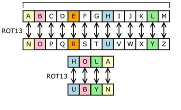
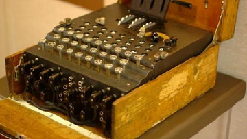
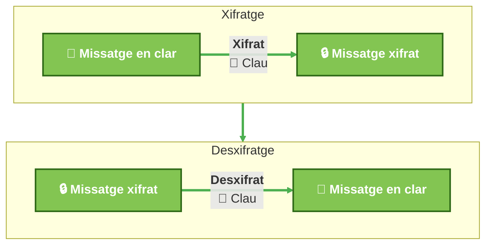
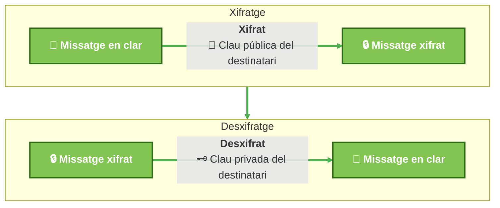
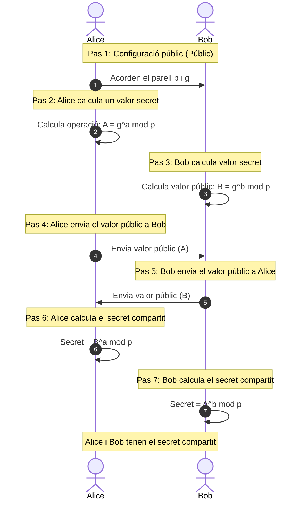
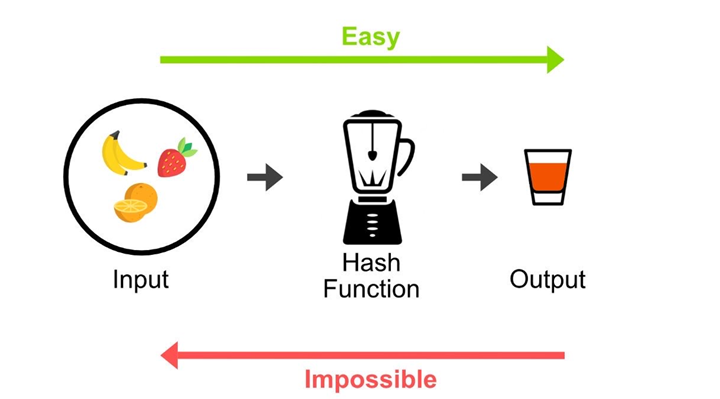
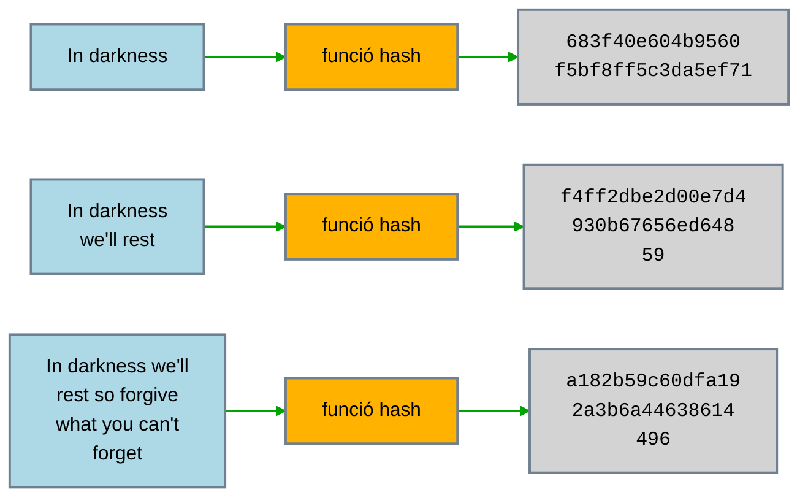

# AA3. Criptografia

## Introducció

És la ciència que s’encarrega de protegir la confidencialitat i la integritat de les dades. La criptografia moderna, també s’encarrega de solucionar el problema de garantir les identitat  a les comunicacions i dades.

Durant segles la criptografia s’ha utilitzat per protegir missatges de mirades indiscretes. Des del Codi Cèsar a la màquina de xifrat Enigma dels alemanys al Segona Guerra Mundial.

|  |  |
| -------------------------------- | ------------------------------------- |
| Codi Cèsar                       | Màquina Enigma                        |

De la mateixa manera que va néixer la criptografia, també va néixer la criptoanàlisi, que és la ciència que s’encarrega de trencar els codis i xifrats. La criptoanàlisi moderna s’encarrega de trencar els xifrats i algorismes de seguretat.

El **xifrat** és el procés de transformar un missatge llegible (anomenat text pla) en un missatge inintel·ligible (anomenat text xifrat) mitjançant un algorisme i una clau. El procés invers, anomenat desxifrat, transforma el text xifrat de nou en text pla.

I quan de segur són els sistemes de xifrat? Es parla de **seguretat incondicional** quan un sistema de xifrat és segur fins i tot si l’atacant té un poder computacional infinit, un exemple d’això és el [xifrat de Vernam](https://en.wikipedia.org/wiki/Vernam_cipher). En canvi, la majoria dels sistemes de xifrat moderns són **condicionalment segurs**, és a dir, són segurs per l'estat de la tecnologia actual, però en un futur, amb més poder computacional, podrien ser trencats. Per exemple, el xifrat AES és segur amb la tecnologia actual, però en un futur podria ser trencat amb ordinadors quàntics.

> 💡No confondre xifrar amb codificar. Una codificació no assegura la confidencialitat, simplement representa la informació amb un alfabet o codi determinat. Exemple, `Base64` s'usa per transmetre informació binària per canals que només admeten text simple. Per nosaltres pot semblar informació il·legible, però aplicant la decodificació qualsevol pot recuperar la informació original.

## Criptografia de clau simètrica

També coneguda com a criptografia de clau secreta o compartida, és un tipus de criptografia on la mateixa clau s’utilitza tant per xifrar com per desxifrar la informació. Per tant, en comunicacions, tant l’emissor com el receptor han de conèixer la clau i mantenir-la en secret.

Alguns dels algorismes més coneguts són:

- AES (Advanced Encryption Standard)
- DES (Data Encryption Standard) i 3DES (Triple DES)
- IDEA (International Data Encryption Algorithm)
- RC4 (Rivest Cipher 4)
- Blowfish

L’algoritme recomanat avui dia és AES amb longitud de claus de 256 bits. Va ser establert com a estàndard de xifratge pel govern dels Estats Units el 2001 i és àmpliament utilitzat en aplicacions comercials i governamentals d'arreu del món. AES és un algorisme de xifratge simètric que utilitza blocs de dades de 128 bits i claus de 128, 192 o 256 bits. És molt segur i eficient, i ha resistit amb èxit els intents de trencar-lo fins ara.

RC4 és popular per servir per xifrat en temps real (xifrat de fluxe) tot i que és molt menys segur que AES, però té l'avantatge de ser molt ràpid i senzill d’implementar i permet el que el xifrat i desxifrat es realitzi en temps real.

### Avantages i inconvenients xifrat simètric

Avantatges:

- Permet assegurar la Confidencialitat (secret).
- Els algorismes són relativament ràpids per a xifrar i desxifrar (comparats amb els asimètrics).
- El xifrat és més segur i el missatge xifrat és més curt que amb els algorismes de clau pública.

Inconvenients:

- Com intercanviar la clau en comunicacions a distància? Si la clau és interceptada, l’atacant pot desxifrar els missatges.
- No garateixen la integritat (modificació del missatge). Si algú coneix la clau, pot modificar el missatge i tornar-lo a xifrar.
- No asseguren la vinculació (no rebuig).

## Criptografia de clau pública

S’utilitzen un parell de claus: una clau privada i una clau pública. El remitent utilitza la clau pública del destinatari per xifrar el missatge. Per desxifrar-lo cal la clau privada corresponent. Amb aquest sistema se soluciona el problema de l’intercanvi de claus.

Les dues claus (pública i privada) estan matemàticament relacionades, però és computacionalment inviable deduir la clau privada a partir de la clau pública. Això permet que qualsevol pugui xifrar missatges per a un destinatari concret, però només el destinatari pot desxifrar-los.

Principals algoritmes:

- RSA (Rivest, Shamir, Adleman)
- DSA
- ElGamal
- Criptografia de corba el·líptica: Fan servir equacions cúbiques (de tercer grau).

Amb la criptografia de clau pública també es poden **signar missatges**, garantint la integritat i l’autenticitat del missatge. Signar no fa que el missatge sigui confidencial, sinó que permet verificar que el missatge no ha estat modificat i que prové del remitent que diu ser. A la propera unitat veurem amb més detall com funciona la signatura digital.

### Avantages i inconvenients xifrat clau pública

Avantatges:

- Resolen el problema de l’intercanvi de claus.
- Permeten la **signatura digital**.
- Permet autenticació mútua o unilateral.
- En sistemes de comunicació múltiple només cal un parell de claus per a cada usuari, en lloc d’una clau diferent per a cada parella d’usuaris.

Inconvenients:

- Els algorismes són més lents que els de clau simètrica.
- Les claus són més llargues que les de clau simètrica.
- Els missatges xifrats són més llargs que amb els algorismes de clau simètrica.

## Criptografia híbrida

Hem vist com el xifrat simètric i el de clau pública tenen avantatges i inconvenients. Per això, en la pràctica, s’utilitzen sistemes híbrids que combinen els dos tipus de xifrat.

Per xifrar el missatge s’utilitza un algoritme simètric utilitzant un clau que es calcula per aquella comunicació en concret ( clau de sessió).

L'intercanvi de claus es realitza amb un algoritme de clau pública. D’aquesta manera, es combina la seguretat del xifrat de clau pública amb la velocitat del xifrat simètric.

El primer protocol de comunicació segura per web SSL, usava aquest model, usant la clau pública del servidor per xifrar la clau de sessió (RSA) i després utilitzant aquesta clau de sessió per xifrar la comunicació amb una xifrat simètric (RC4 o DES).

El problema és que amb el temps RSA requeria claus més llargues i això feia que el càlcul de la clau de sessió fos més lent. Per aquest motiu, l'intercanvi de claus usa ara l'algoritme de **Diffie-Hellman**.

### Algoritme de Diffie-Hellman

Realment no és un sistema de clau pública/privada, si no que serveix per generar una clau de sessió de forma segura. És a dir, **no intercanviem la clau de sessió**, sinó que la generem de forma que només els dos participants puguin calcular-la.

La seguretat es basa a la dificultat de calcular [logaritmes discrets](https://ca.wikipedia.org/wiki/Logaritme_discret)

Els dos participants acorden usar dos nombres públics: un nombre primer (p) i un generador (g).

> 💡L'operació $A= g^a \mod p$ significa que fem la potència i del resultat es calcula el residu de la divisió amb `p`. Això que us pot semblar molt estrany, és l'àlgebra de nombres discrets o de conjunt finits. És un cas similar a si voleu saber quin dia de la setmana serà d'aquí a 57 dies. Si suposeu que avui és dimarts (dia 2), aleshores el dia de la setmana serà `(2 + 57) mod 7 = 59 mod 7 = 3`, és a dir, dimecres.

La fortalesa de l'algoritme és que, encara que un atacant conegui els valors públics (p, g, A i B), no podrà calcular la clau de sessió compartida sense conèixer els secrets a i b. Perquè això sigui cert cal que p sigui un nombre primer molt gran (per exemple, de 2048 bits) i que g sigui un generador adequat. Es van definir grups de generador i nombre primer que són segurs i que es poden utilitzar per a l'algoritme de Diffie-Hellman. Aquests grups es coneixen com a "grups de Diffie-Hellman" i es troben documentats a diversos RFCs. Actualment, es recomana utilitzar grups de Diffie-Hellman amb nombres primers d'almenys 2048 bits [RFC3526](https://www.rfc-editor.org/info/rfc3526/#section-2) o millor encara, utilitzar l'algoritme de corbes el·líptiques (ECDH)[RFC 8418](https://datatracker.ietf.org/doc/html/rfc8418) que ofereix la mateixa seguretat però treballant amb nombres més petits (les claus d'intercanvi de corbes el·líptiques poden ser de 256 bits i oferir la mateixa seguretat que una clau de 3072 bits en Diffie-Hellman).

Diffie-Hellman aplica **forward secrecy**, és a dir, que si un atacant aconsegueix la clau privada d’un dels participants, no podrà calcular les claus de sessió passades. Un cop la sessió ha acabat, la clau de sessió s'elimina de la RAM d'ambdós participants.

## Control d'integritat

Per garantir la integritat dels missatges s’utilitzen funcions de **hash** o resum, que generen un conjunt de bits per a cada entrada. Aquest resum té una longitud fixa determinada per l'algoritme i no per la mida del missatge. Aquestes funcions han de complir tres condicions:

1. Donat el missatge és senzill calcular el resum.
2. És impossible a partir del resum obtenir el missatge.
3. Dos missatges no haurien de poder generar el mateix resum (col·lisions).

La idea que una funció de hash no sigui reversible, pot semblar difícil d'entendre, però podeu pensar a una liquadora amb fruita.

Per comprovar la integritat es genera el hash en recepció del missatge i es compara amb el hash rebut.

Els algoritmes de resum més usats avui dia: SHA 256 i SHA 512.El número fa referència a la mida del resum en bits, altres algoritmes que s'havien usat anteriorment com MD5 o SHA-1 són obsolets no només per la mida del resum obtingut, sinó també perquè s'han trobat vulnerabilitats que permeten trobar col·lisions.

El tercer punt òbviament és impossible de garantir, perquè existeixen infinites entrades possibles (missatges) i només un nombre finit de resums possibles ($2^{longitud}$). Però la probabilitat que això passi (col·lisió és extremadament baixa si l'algoritme és segur i la longitud del resum és prou gran).

Al enllaços teniu un eina online que us permet calcular el has d'un missatge.

> 💡Existeix una variant que és el HMAC (hash-based message authentication code) que combina el resum amb la incorporació d'una clau secreta compartida. Això és útil perquè a més de la integritat, permet garantir la autenticitat de l'emissor.

### Usos del hash

- Validar que un missatge o fitxer no ha estat modificat (malware, atacs, etc.), comparant el hash calculat amb el hash original.
- Comprovar la integritat de fitxers descarregats d’internet, comparant el hash del fitxer descarregat amb el hash publicat pel desenvolupador. Això és molt habitual quan es descarreguen imatges ISO de sistemes operatius, com Ubuntu, Debian, etc.
- Emmagatzemar les contrasenyes de forma segura. Quan l’usuari introdueix la contrasenya, es calcula el hash i es compara amb el hash emmagatzemat i així es garanteix el secret de la contrasenya.
- Signatura digital. Quan a la unitat següent estudiem la signatura digital, veurem que la signatura (clau privada) s'aplica sobre un hash del missatge o document, no sobre l'original.

## Enllaços d'interès

- [Practical Networking. Cryptography](https://www.practicalnetworking.net/series/cryptography/cryptography/)

- [DCODE. Codi de rotació o de Cèsar](https://www.dcode.fr/rot-cipher)

- [101 Computing. Emulador màquina Enigma](https://www.101computing.net/enigma-machine-emulator/)

- [Online Hash Calculator](https://cryptotools.net/hash)
