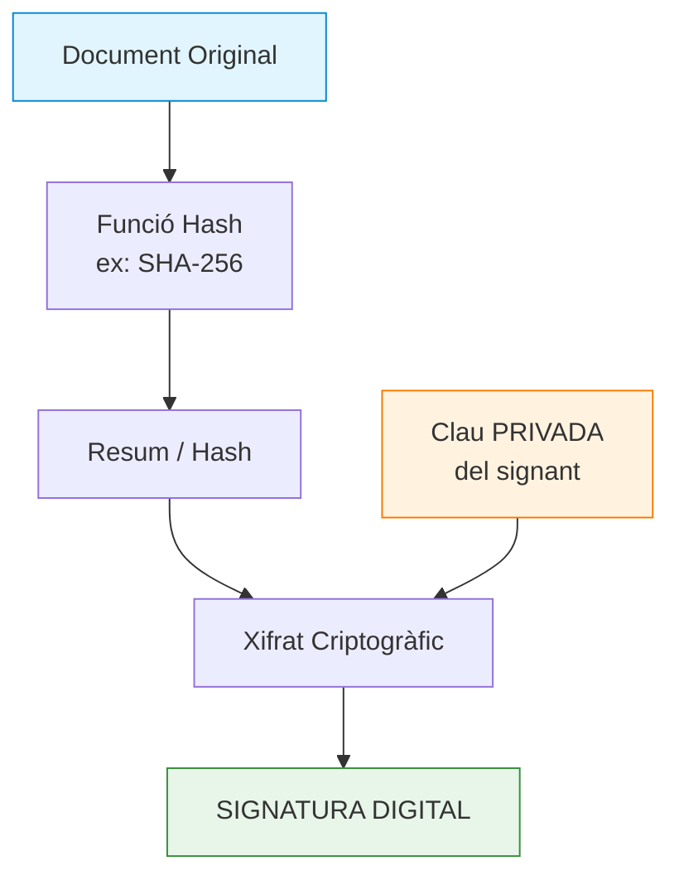
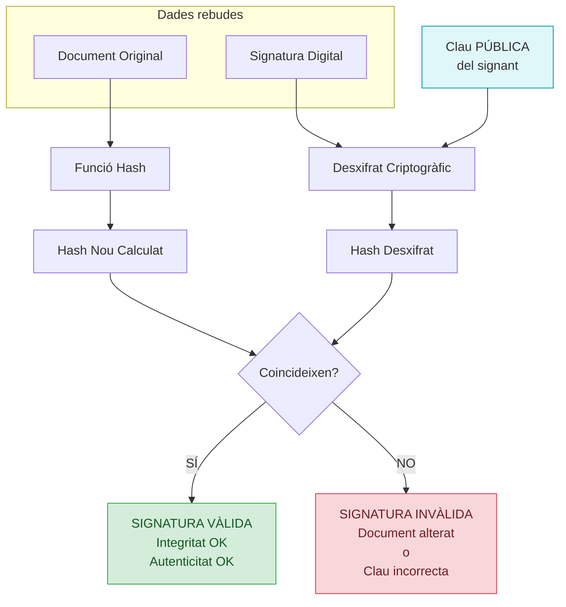
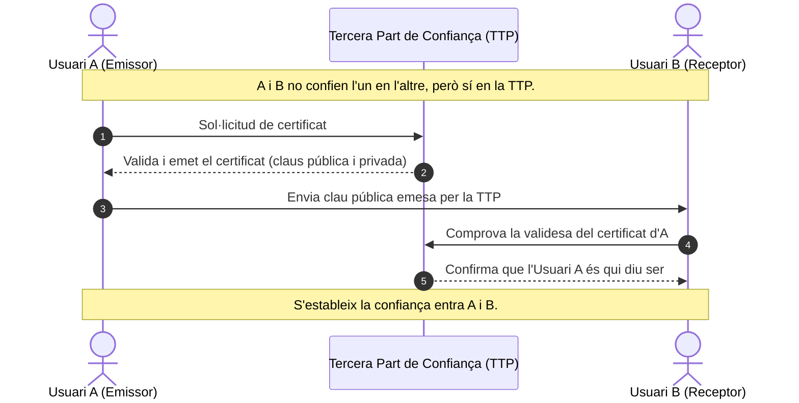
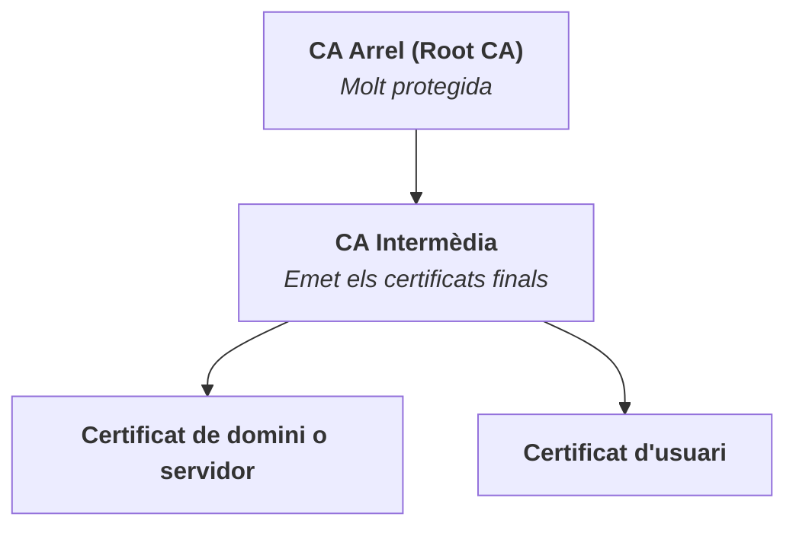

# A4. Signatura Digital

## Introducció

En el món físic la signatura ha estat durant molt de temps el mecanisme que permetia identificar a una persona i garantir la seva autorització sobre un document. De la mateixa manera, en el món digital, ens cal un mecanisme que permeti identificar a una persona i garantir la seva autorització sobre un document electrònic.

D'aquí neix la necessitat d'una signatura pel món digital i apareixen dos conceptes relacionats i que sovint es confonen entre ells: la signatura electrònica i la signatura digital.

- **Signatura Digital**: És el mecanisme tècnic i criptogràfic que s'utilitza per xifrar i protegir les dades d'un document.

- **Signatura Electrònica**: És el concepte legal i jurídic que atorga validesa a la voluntat d'una persona de signar un document en format digital.

> 💡 La signatura digital és la tecnologia; la signatura electrònica és el concepte legal que li dóna validesa jurídica.

## Signatura digital

La signatura digital es basa en la criptografia asimètrica (parell de claus pública/privada) combinada amb funcions hash (algoritmes de resum).

### Com funciona el procés de signatura?

- **Generació del Hash**: S'aplica una funció hash (per exemple, SHA-256) al document original per obtenir un resum únic de mida fixa ($H(M)$).

- **Xifrat del Hash**: El resum s'xifra utilitzant la **clau privada** del signant. El resultat d'aquest xifrat és la signatura digital.

- **Enviament**: S'envia el document original juntament amb la signatura digital generada.

### Com es verifica la signatura?

- **Recepció**: El receptor rep el document i la signatura digital.

- **Desxifrat**: El receptor desxifra la signatura utilitzant la clau pública del signant per obtenir el hash original.

- **Càlcul del Hash**: El receptor calcula un nou hash del document rebut (recordeu que ve en text pla).

- **Comparació**: Si tots dos resums coincideixen, el document és autèntic i no ha estat modificat.

### Objectius de seguretat coberts per la signatura digital

- **Autenticitat**: Assegura que l'emissor és qui diu ser (només ell té la clau privada).

- **Integritat**: Garanteix que el document no s'ha alterat durant el trajecte (qualsevol canvi en el document canviaria el hash).

- **Vinculació (no-repudi)**: El signant no pot negar haver creat la signatura, ja que la clau privada és secreta i exclusiva seva.

## El problema de la identitat

Ara ja sabem que per signar digitalment un document necessitarem un parell de claus (pública i privada). Evidentment, podem crear un parell de claus qualsevol, però com podem garantir que la clau pública que ens arriba és realment del signant i no d'un impostor? Com poder aconseguir que la nostra clau pública sigui reconeguda com a vàlida i que ningú pugui fer-se passar per nosaltres?

Aquí entra el problema de la identitat i la confiança. Bàsicament hi ha dues estratègies per resoldre aquest problema:

- **Sistemes basats en la confiança**: els usuaris confien entre ells i es validen mútuament les claus públiques.

- **Certificats digitals**: hi ha una entitat de confiança que garanteix la identitat dels usuaris i emet certificats digitals que vinculen la identitat amb la clau pública.

### Sistemes descentralitzats

En aquest model, els usuaris confien entre ells i es validen mútuament les claus públiques, per tant, és un model basat en la confiança entre persones.

Un exemple d'aquest model és el sistema PGP (Pretty Good Privacy) actualment **OpenPGP**, on els usuaris poden signar les claus públiques d'altres usuaris per certificar que són vàlides. Això crea una xarxa de confiança on la validesa d'una clau pública depèn de les signatures d'altres usuaris.

Existeixen servidors web (anells de claus) on els usuaris poden pujar les seves claus públiques i les signatures d'altres usuaris. Això permet que qualsevol persona pugui verificar la validesa d'una clau pública buscant-la en aquests servidors i veient quantes signatures té.

Un exemple d'aquests servidors és [https://keys.openpgp.org](https://keys.openpgp.org). També hi ha solucions comercials com [Mailvelope](https://www.mailvelope.com/) que s'utilitza per xifrar i signar correus electrònics amb OpenPGP, aquí es vincula la clau a un correu elèctrònic.

### Certificats digitals

Els certificats, el més populars els X.509, es basen en la creació del parell de claus, però on una entitat certificadora signa la clau pública de l’usuari o domini per donar-li validesa. En entorns privats podem usar claus **autosignades**, com les que es heu usat a `Serveis de Xarxa` per a la creació de servidors sFTP o web amb HTTPS, però en entorns públics és necessari que una entitat certificadora reconeguda signi la clau pública. Un exemple és Clave Permanente de l’Administració (FNMT-RCM) o l'IDCat.

El format de certificat que s'utilitza més habitual és el **X.509**, que conté la clau pública, la identitat del titular, un número de serie, la informació de l'entitat emissora, la data de caducitat. Tota aquesta informació ve signada digitalment per l'entitat certificadora (CA) que garanteix la validesa del certificat.

### Trusted Third Party (TTP)

Molt bé, tenim certificats, però com poder saber realment que el certificat correspon a la persona que diu ser?

Pensem en el món físic, segur que en teniu un munt de carnet o targetes que us identifiquen: el del "Club Super3", la targeta de client del supermercat, el DNI, el passaport, etc. Oi que si voleu agafar un avió no presentareu el carnet del del Super3? Penseu perquè, què diferència aquest carnet o el de la biblioteca d'un DNI o passaport?

La diferència és que el carnet del Super3 no té cap valor legal, mentre que el DNI o passaport sí que tenen valor legal i són reconeguts per les autoritats. Doncs bé, en el món digital passa el mateix, perquè dues persones o sistemes que no es coneixen puguin confiar l'un en l'altre a Internet, necessiten un element intermediari en el qual tots dos confiïn prèviament.

Una TTP (Trusted Third Party) és una entitat independent i neutral, reconeguda per totes les parts, que dona fe que una clau pública concreta pertany realment a una persona, empresa o servidor determinat.

Quan ens ensenyen un DNI, confiem en la identitat d'aquella persona no perquè la coneguem, sinó perquè confiem en l'organisme oficial (el Govern/Policia) que ha emès aquest document. La TTP actua com aquest organisme oficial. Valida la identitat del sol·licitant i "segella" aquesta informació creant un certificat digital.

### Autoritats de certificació (CA)

L'Entitat de Certificació (CA o EC) és la concreció pràctica d'una TTP en l'àmbit de la seguretat informàtica. Les seves funcions principals són:

- **Validar la identitat**: Comprovar que qui demana un certificat és realment qui diu ser (mitjançant presència física, verificació de domini, documentació oficial, etc.).

- **Emetre i signar certificats**: Generar el document digital que vincula la clau pública amb les dades del titular i signar-lo amb la clau privada de la mateixa CA.

- **Gestionar la revocació**: Mantenir llistes actualitzades dels certificats que han deixat de ser vàlids abans de la seva data de caducitat (per exemple, per robatori de la clau privada).

Les CA poden ser **públiques**: reconegudes per tots els navegadors i sistemes operatius. Dins d'aquesa categoria, podem ser organitzacions privades com DigiCert, GlobalSign, Let's Encrypt o organitzacions governamentals com la FNMT, CatCert, etc. També es poden crea entitats de certificació **privades**, per a ús intern d'una organització.

Les entitats de certificació segueixen un model jeràrquic:

- **CA Arrel (Root CA)**: És l'autoritat suprema. La seva clau pública ve instal·lada de fàbrica als navegadors i sistemes operatius (Windows, Linux, Android, etc.).

- **CA Intermèdia (Intermediate CA)**: Per motius de seguretat, la CA Arrel no s'usa per al dia a dia. Es deleguen les tasques d'emissió a CAs intermèdies.

### Infraestructura de clau pública (PKI)

Una PKI no és un únic programa o servidor, sinó tot el conjunt de tecnologies, serveis, polítiques i procediments necessaris per gestionar el cicle de vida complet dels certificats digitals. Per tant, inclou components lògics (rols i entitats), elements criptogràfics, d'infraestructura, així com unes polítiques i procediments.

1. **Component lògics (rols i entitats)**:

    - **Autoritat de Certificació (CA)**: És el nucli del PKI i actua com a "notari digital". La seva funció és emetre, signar i revocar certificats digitals, enllaçant una identitat (persona o dispositiu) amb la seva clau pública.

    - **Autoritat de registre (RA)**: És l'intermediari entre l'usuari final i la CA. La vostra tasca és verificar la identitat del sol·licitant abans que la CA emeti el certificat.

    - **Autoritat de Validació (VA)**: Serveis dedicats a comprovar l'estat dels certificats (siguin vàlids o revocats) en temps real (protocol OCSP).

    - **Time Stamping Authority (TSA)**: Certifica la data i l'hora exactes en què es va fer una transacció o es va signar un document.

2. **Elements criptogràfics**:

    - **Certificats Digitals**: Documents electrònics que continguin la clau pública i les dades d'identitat d'un usuari o servidor, signats digitalment per la CA.

    - **Parell de claus (públic/privat)**: sistema criptogràfic asimètric. La clau pública es comparteix, mentre que la clau privada es manté en secret per xifrar i signar dades.

3. **Elements d'infraestructura**:

    - **Repositoris de certificats**: Servidors on es poden consultar i descarregar certificats digitals i les llistes que contenen els certificats que han estat revocats abans de la seva data de caducitat (CRL).

4. **Polítiques i procediments**:

    - **Declaració de Polítiques i Pràctiques de Certificació (CPS)**: El conjunt de normes, reglaments i procediments legals que defineixen com funciona el PKI i les responsabilitats de cada participant

### Atacs a la identitat

De tota manera els certificats digitals no garanteixen la seguretat absoluta (igual que un DNI o un passaport es pot falsificar) i s'han produit incidents de seguretat importants que han afectat a entitats de certificació reconegudes. Per exemple, el 2011, l'autoritat de certificació DigiNotar va ser víctima d'un atac informàtic que va permetre a un atacant emetre certificats digitals falsos per a diversos dominis, incloent Google. Aquest incident va provocar la revocació massiva dels certificats emesos per DigiNotar i va provocar la seva fallida [enllaç a la notícia](https://www.welivesecurity.com/la-es/2011/10/07/ataque-informatico-lleva-diginotar-quiebra/).

Els atacs no només provenen de ciberdelinqüents. Edward Snowden va filtrar que la NSA (National Security Agency) va falsificar certificats digitals per suplantar pàgines legítimes com Google, Yahoo o Facebook per espiar i interceptar les comunicacions dels usuaris [enllaç a la notícia](https://www.genbeta.com/seguridad/la-nsa-habria-estado-suplantando-a-google-y-otros-servicios-para-espiar-trafico-de-sus-objetivos).

Una altra tècnica que es va utilitzar amb èxit són els [atacs homogràfics](https://www.welivesecurity.com/la-es/2017/07/13/ataques-homograficos/) consisteixen a registrar dominis i certificats amb noms molt semblants a un domini legítim, però amb caràcters diferents, per exemple un "1" per a un "l" o "rm" per una "m". A més, amb l'ús de caràcters Unicode, es poden crear dominis que visualment semblen iguals a un altre legítim, però que són completament diferents. Per exemple, el domini "gοοgle.com" (amb la lletra omicrom grega) pot semblar "google.com" (amb lletres "o"), i un usuari podria ser enganyat per visitar el lloc equivocat.

> ❗Actualment, les entitats de certificació han implementat mesures per evitar acceptar certificats per dominis homogràfics, de tota manera mirar d'enganyar l'usuari amb dominis similars és una tècnica que encara es fa servir en atacs de phishing, com exemple, teniu aquest SMS que es fa passar per Netflix:
>
> NETFLIX: Tu ultimo pago fue rechazado.
>
> Tu cuenta sera suspendida el 20/07/2026. Renueva tu pago en: <https://netlfix-cu.com/>

A nivell d'usuari podem prendre alguns precaucions per evitar ser víctimes d'atacs a la identitat, sigui la nostra o la del lloc web que visitem:

- Protegir la clau privada del nostre certificat digital, no compartir-la amb ningú i no deixar-la en dispositius que puguin ser compromesos, preferentment protegida amb una contrasenya.

- Quan visitem un lloc web amb certificat digital, comprovar que el certificat és vàlid i que el domini és correcte. No confiar en dominis similars o amb errors tipogràfics.

- No accedir a enllaços sospitosos que ens arribin per correu electrònic, SMS o missatgeria instantània. Sempre és millor escriure l'adreça del lloc web directament al navegador.

## Signatura electrònica

Com s'ha dit anteriorment la signatura electrònica és un concepte legal i jurídic que té com objectiu **demostrar la voluntat o consentiment de l'usuari**. En ser un concepte jurídic, no entra en aspectes tecnològics, de manera que es pot complir amb diferents mecanismes tècnics, com ara la signatura digital, el PIN, la contrasenya, un check en un qüestionari, etc.

A la Unió Europea, la signatura electrònica està regulada pel **Reglament eIDAS** (Reglament UE 910/2014). Aquesta normativa defineix tres nivells de seguretat jurídica:

- **Signatura electrònica simple**: És la signatura electrònica bàsica, que pot ser qualsevol mecanisme que permeti identificar a l'usuari i demostrar la seva voluntat de signar un document. Per exemple, escriure el teu nom al final d'un correu electrònic, marcar una casella de "Acepto les condicions" o la signatura digitalitzada (la que fas sobre el tablet o smarpthone d'un repartidor quan et lliura un paquet).

- **Signatura electrònica avançada**: Permet signar un document digital garanteix qui el signa i que ningú ha modificat el document posteriorment. A diferència de la signatura simple, l'avançada utilitza tecnologia per vincular de forma inseparable la teva identitat amb el document (si es modifica a posteriori, s'invalida la signatura).

- **Signatura electrònica qualificada**: És una signatura avançada que es crea mitjançant un dispositiu segur de creació de signatures (com un xip d'una targeta intel·ligent com el DNIe o un token USB). Es basa en un certificat digital qualificat emès per una Autoritat de Certificació (CA) reconeguda (ex: FNMT, idCAT, DNIe). És obligatòria per a licitacions públiques, procediments amb l’Administració que ho requereixin expressament o acords notarials. Mateixa validesa legal que la signatura manuscrita en paper, amb la presumpció legal de ser vàlida.

A la següent taula es poden veure les diferències entre els tres tipus de signatura electrònica:

| Tipus de Signatura | Nivell de Validesa i Seguretat | Aspectes que Garanteix | Exemples Pràctics |
| :--- | :--- | :--- | :--- |
| **Simple** | **Baix** Té valor jurídic molt limitat. És molt fàcil d'impugnar en un judici, ja que requereix aportar moltes altres proves per demostrar qui la va fer. | - Només demostra la **voluntat o consentiment bàsic**.  - **No garanteix** la identitat real de la persona.  - **No garanteix** la integritat del document (es pot modificar fàcilment sense deixar rastre). | - Marcar la casella "Accepto les condicions d'ús" en un web. -  Enganxar una imatge (PNG/JPG) de la teva signatura manuscrita en un document Word. - Escriure el teu nom al final d'un correu electrònic. |
| **Avançada** | **Mitjà - Alt** Elevada validesa jurídica i gran valor provatori. Si algú la nega en un judici, les evidències tècniques (logs, IP, SMS) serveixen com a prova sòlida. | - **Identificació única** del signant. -  **Control exclusiu** (es fa amb dades que només té el signant).  - **Integritat de les dades** (si el document es modifica un cop signat, la signatura s'invalida). | -  Signar un contracte de lloguer o de feina des del mòbil mitjançant plataformes com *Signaturit* o *DocuSign* (rebent un codi SMS de confirmació). -  Signar un PDF utilitzant un certificat digital en format fitxer (`.p12` o `.pfx`) instal·lat al navegador de l'ordinador. |
| **Qualificada** *(o Reconeguda)* | **Màxim** Equivalència legal **directa i automàtica** a la signatura manuscrita en paper. Té la presumpció legal de ser vàlida (en un judici, qui hagi de dubtar-ne és qui ha de demostrar que és falsa). | -  Tots els requisits de la **Signatura Avançada**.  -  Basada en un **Certificat Qualificat** emès per una Autoritat de Certificació (CA) oficial. -  Creada mitjançant un **dispositiu segur** de creació de signatures (QSCD). -  Garantia absoluta de **vinculació (no repudi)**. | -  Fer un tràmit oficial amb la Hisenda o la Seguretat Social utilitzant el **DNI electrònic (DNIe)** inserit en un lector de targetes intel·ligents. -  Utilitzar un **token USB o targeta criptogràfica** d'una entitat de certificació reconeguda (ex: idCAT en targeta, FNMT) o també un sistema de signatura centralitzada, per exemple, el de la [FNMT](https://www.sede.fnmt.gob.es/certificados/administracion-publica/certificado-de-firma-centralizada). |

## Enllaços d'interès

- [Signicat. Electronic signature: what is it and how to use it](https://www.signicat.com/blog/electronic-signature-what-is-it-and-how-to-use-it)

- [Signicat. Diferencia entre firma electrónica cualificada y avanzada](https://www.signicat.com/es/blog/diferencia-firma-electronica-cualificada-y-avanzada)

- [D. Rivera, "Creación de una PKI en Ubuntu", Blog.pleets.org, 2021](https://blog.pleets.org/article/creación-de-una-pki-en-ubuntu)

-["How to Generate a Certificate Signing Request (CSR) With OpenSSL", Knowledge Base by phoenixNAP](https://phoenixnap.com/kb/generate-openssl-certificate-signing-request)

- ["Create a .pfx/.p12 Certificate File Using OpenSSL - SSL.com", SSL.com](https://www.ssl.com/how-to/create-a-pfx-p12-certificate-file-using-openssl/)
