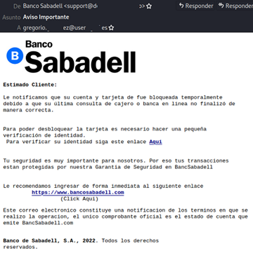
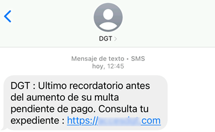

# AA1 Enginyeria Social, Fraus i Robatori d'Informació

## Taula de Continguts

- [1. El Factor Humà com a Vector d'Atac](#1-el-factor-humà-com-a-vector-datac)
- [2. Principals Tècniques d'Enginyeria Social](#2-principals-tècniques-denginyeria-social)
- [3. Impacte en Organitzacions i Empreses](#3-impacte-en-organitzacions-i-empreses)
- [4. Correu no desitjat](#correu-no-desitjat)
- [5. Estratègies de Prevenció i Mitigació](#5-estratègies-de-prevenció-i-mitigació)
- [6- Enllaços d'Interès](#enllaços-dinterès)

---

## 1. El Factor Humà com a Vector d'Atac

En la seguretat informàtica actual, les eines de protecció tecnològiques (com firewalls, IDS/IPS o antivirus) són cada cop més robustes i difícils de superar directament. Per aquest motiu, els ciberdelinqüents prefereixen **atacar la línia de defensa més feble: l'usuari final**.

Un atac d'enginyeria social reeixit pot invalidar completament el sistema de seguretat millor configurat, ja que és el mateix usuari autoritzat qui entrega les seves credencials, desactiva proteccions o executa malware involuntàriament.

> **💡 Idea clau:** L'enginyeria social no busca vulnerabilitats en el codi o en el maquinari, sinó en el factor humà. És la manipulació psicològica de les persones perquè realitzin accions compromeses o revelin informació confidencial.

## 2. Principals Tècniques d'Enginyeria Social

### Suplantació d'Identitat Digital

- **Phishing (Engany massiu):** Enviament de correus electrònics que simulen provenir de fonts fiables (bancs, plataformes de comerç electrònic, proveïdors de serveis o la mateixa empresa) per enganyar l'usuari i capturar les seves contrasenyes o dades bancàries.

     

- **Spear Phishing (Atac dirigit):** Variant personalitzada i altament elaborada adreçada a una persona o departament concret (per exemple, personal del departament de comptabilitat o recursos humans). La diferència principal amb el phishing massiu és que el spear phishing utilitza informació específica de la víctima (com el seu nom, càrrec o projectes en què està involucrat) per fer l'atac més convincent.

- **Whaling (Atac a alts càrrecs):** Atac de phishing dissenyat especialment per a executius de l'alta direcció (CEO, directors financers), on l'impacte potencial és elevadíssim. És una variant del spear phishing, però amb un enfocament en la jerarquia corporativa i amb missatges que poden incloure informació confidencial de l'empresa.

### Canals Alternatius de Suplantació

- **Smishing (SMS Phishing):** Utilització de missatges de text al mòbil amb enllaços maliciosos o peticions urgents d'acció. Com és senzill falsificar la capçalera del remitent, el SMS fraudulent pot semblar legítim i fins i tot, aparèixer a un fil de missatges legítim.

     

- **Vishing (Voice Phishing):** Enginyeria social realitzada per via telefònica (veu), on l'atacant suplanta el suport tècnic, entitats bancàries o personal d'auditoria.

> ❗**Nota:** Amb els avanços que ha tingut la intel·ligència artificial, els atacants poden generar missatges de veu i fins i tot videoconferències falses amb gran realisme, fent que la suplantació sigui encara més creïble. S'està utilitzant amb èxit [4](https://kymatio.com/es/blog/vishing-deepfake-voice-fraude-ceo)

### Tècniques Basades en la Contextualització i la Causalitat

- **Pretexting (Creació d'un pretext):** L'atacant elabora un escenari fictici o una història elaborada per guanyar-se la confiança de la víctima i fer que li faciliti accés a informació privilegiada o sistemes de l'organització: per exemple, fer-se passar per un tècnic de TI que necessita accedir a un servidor per solucionar un problema urgent.

- **Baiting (Ganxo):** Ús d'un esquer físic o digital atractiu. Un exemple clàssic és deixar una memòria USB infectada en un lloc públic (com l'aparcament o la recepció de l'empresa) amb una etiqueta cridanera (ex: `Nòmines_2026.xlsx`).

### Tècniques d'Observació i recol·lecció d'informació

- **Shoulder Surfing (Mirada per sobre de l'espatlla):** Observació directa de les tecles o pantalles quan la víctima escriu contrasenyes, PINs o codis d'accés.

- **Dumpster Diving (Cerca a la brossa):** Recerca d'informació confidencial (llistes d'usuaris, manuals, contrasenyes anotades) en paper no destruït adequadament.

> 💡**Nota**: Kevin Mitnick [6](https://youtu.be/0X0pDsglgno?si=rsK5VAU5v609lZx4 )va ser un dels hackers més famosos de la dècada dels 90 del segle XX. Era un expert en aconseguir accés mitjançant tècniques d'enginyeria social, entre elles la cerca d'informació a partir de la brossa de les empreses i organitzacions. Va ser detingut i després de passar uns anys a pressó, va treballar com expert en seguretat i va escriure un dels llibres clàssics del món hacker "The art of deception" on explica diverses tècniques d'enginyeria social.

## 3. Impacte en Organitzacions i Empreses

- **Frau del CEO / Frau del Proveïdor:** Mitjançant la suplantació d'identitat d'un directiu o la interceptació de factures de proveïdors, els atacants aconsegueixen que els empleats realitzin transferències bancàries fraudulentes a comptes controlats pels cibercriminals.

- **Infecció per Ransomware:** Més del 80% dels atacs de ransomware s'inicien amb un correu de *phishing* on l'usuari descarrega un fitxer adjunt infectat o fa clic en un enllaç maliciós.

- **Exfiltració de Dades i Sancions Legals (RGPD / LOPDGDD):** El robatori d'informació corporativa o dades personals comporta greus pèrdues econòmiques, danys reputacionals irreparables i sancions administratives elevades si no es comuniquen correctament i si no s'han pres mesures de seguretat adequades.

## 4. Correu no desitjat

Correu brossa (spam) és el nom genèric que es dóna a qualsevol tipus de comunicació no desitjada que es fa de manera electrònica.

> 💡 L’origen del terme "spam" prové d’un tipus de pernil de llauna molt popular a Anglaterra durant els anys de la postguerra. El grup humorístic anglès Monty Python té un gag en què uns víkings van a un restaurant i demanin el plat que demanin, sempre els hi porten SPAM.

El correu brossa provoca a part de les molèsties evidents per l'usari que el rep dos grans inconvenients:

- El consum de recursos de la xarxa que genera congestió i retards.
- Saturació de les bústies de correu, que poden arribar a bloquejar la recepció de correus legítims.

Des d'un punt de vista legal, el correu brossa és una pràctica il·legal i sancionable. La Llei 34/2002 de Serveis de la Societat de la Informació i Comerç Electrònic (LSSI-CE) estableix que l'enviament de correu electrònic amb finalitats comercials sense el consentiment previ del destinatari és considerat una infracció greu, però en qualsevol cas, la majoria de correus brossa provenen de fora de l'àmbit legal i no es poden perseguir.

### Protecció contra el correu brossa

La protecció contra el correu brossa implica implentar mesures a diversos nivells:

- **Configuració dels protocols SPF, DKIM i DMARC** per verificar la legitimitat dels remitents. És molt important configurar correctament     aquests protocols pels nostres dominis, ja que si no es fa, la resta de servidors de correu poden considerar els nostres missatges com a sospitosos i bloquejar-los. Aquests protocols serveixen per verificar que el correu prové d'un servidor autoritzat pel domini i que no ha estat alterat durant el trànsit. A més, especifiquen com s'ha de tractar el correu que no compleix amb aquests requisits (per exemple, enviar-lo a la carpeta de correu brossa o rebutjar-lo directament).
  
- **Filtrat de correu brossa:** Configuració de filtres de correu brossa (spam filters) que analitzen el contingut dels missatges i els marquen com a sospitosos o els bloquegen directament. Aquests filtres poden usar diferents tecnologies:

  - **Ús de llistes**:
    - Llistes negres (blacklists): Llistes de dominis i adreces IP conegudes per enviar correu brossa. Si un missatge prové d'una adreça que està en una llista negra, es pot bloquejar automàticament.
    - Llistes blanques (whitelists): Llistes de dominis i adreces IP de confiança. Els missatges d'aquestes adreces es permeten sense restriccions.
    - Llistes grises (greylists): Els missatges d'adreces desconegudes es posen en espera temporalment. Els servidors legítims solen tornar a intentar enviar el missatge, mentre que els spammers sovint no ho fan, cosa que ajuda a filtrar-los.
  
  - **Filtres heurístics (regles):** Analitzen el contingut del missatge i busquen patrons típics de correu brossa, com ara certes paraules clau, enllaços sospitosos o formats de missatge inusuals. Cada violació de les regles pot sumar punts, i si el missatge supera un cert llindar, es marca com a correu brossa.

  - **Filtrat bayesià (aprenentatge automàtic):** Utilitza tècniques d'aprenentatge automàtic per analitzar el contingut dels missatges i determinar la probabilitat que siguin correu brossa basant-se en l'historial de missatges rebuts i classificats com a legítims o brossa.

> ❗**Eines**: algunes de les eines més populars per a la protecció contra el correu brossa són SpamAssassin i MailScanner.

## 5. Estratègies de Prevenció i Mitigació

1. **Formació i Conscienciació Contínua:** Realització de simulacres de *phishing* periòdics i formació en la identificació d'indicadors de sospita (remetents estranys, urgència injustificada, dominis similars però falsos).

2. **Autenticació Multifactor (MFA / 2FA):** Implementar sistemes on, tot i que el ciberdelinqüent aconsegueixi la contrasenya via *phishing*, necessiti un segon factor de verificació (aplicació d'autenticació o clau de seguretat física).

3. **Principi del Mínim Privilegi:** Garantir que cada usuari només tengui accés a la informació i recursos estrictament necessaris per a les seves funcions laborals.

4. **Polítiques de Seguretat i Procediments de Resposta:** Establir protocols clars per a la gestió d'incidents, incloent la notificació immediata de possibles atacs i la desconnexió de sistemes compromesos.

5. **Configuració de Filtres de Correu i Sistemes de Detecció:** Utilitzar solucions de filtratge de correu electrònic que detectin i bloquegin missatges sospitosos abans que arribin a la safata d'entrada dels usuaris.

## 6. Enllaços d'Interès

1. [ESET-Phising](https://www.eset.com/es/caracteristicas/phishing/)

2. [INCIBE. Fraude del CEO: el engaño que puede vaciar la cuenta de tu pyme](https://www.incibe.es/empresas/blog/fraude-del-ceo-el-engano-que-puede-vaciar-la-cuenta-de-tu-pyme)

3. [Trend Micro. ¿Cuáles son los diferentes tipos de ataques de phishing?](https://www.trendmicro.com/es_es/what-is/phishing/types-of-phishing.html)

4. [Kymatio. Vishing & Deepfake Voice: La Guía Definitiva para Proteger a su Empresa del Fraude de Voz](https://kymatio.com/es/blog/vishing-deepfake-voice-fraude-ceo)

5. [BBC World Service. Can BBC reporter's AI clone fool his colleagues?. YouTube](https://youtu.be/lH608DfrAxU?si=ZKtUDBXFgj2LBODT)

6. [Lord Draugr. Ascenso y caída de Kevin Mitnick: el hacker más famoso de la historia. YouTube](https://youtu.be/0X0pDsglgno?si=rsK5VAU5v609lZx4)

7. [hackmetrix. Test de phising](https://test-phishing.hackmetrix.com)

8. [PowerDMARC. All About SPF, DKIM, and DMARC](https://powerdmarc.com/es/all-about-spf-dkim-dmarc/)
