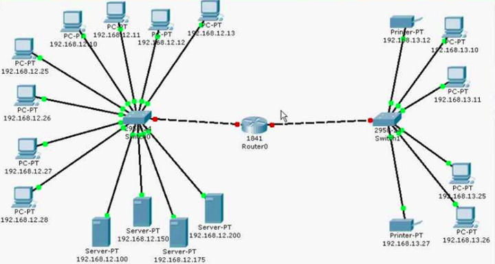
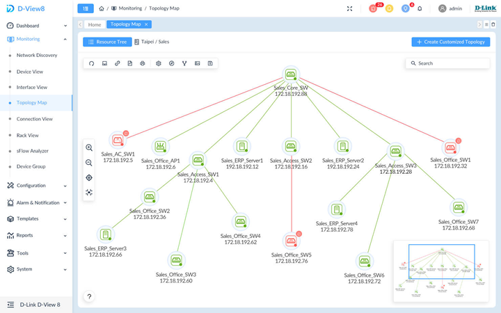
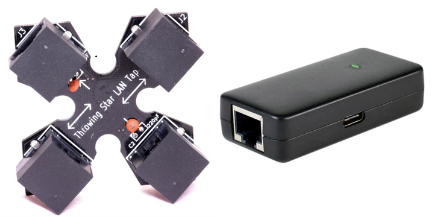

# AA2 Inventari i Monitorització de la xarxa

## Taula de continguts

- [1. Introducció](#1-introducció)
- [2. Inventari de la xarxa](#2-inventari-de-la-xarxa)
- [3. Monitorització de la xarxa](#3-monitorització-de-la-xarxa)
- [4. Protecció del trànsit de xarxa](#4-protecció-del-trànsit-de-xarxa)
- [5. Seguretat en xarxes sense fils](#5-seguretat-en-xarxes-sense-fils)
- [6. Enllaços d'interès](#6-enllaços-dinterès)

---

## 1. Introducció

Per controlar i garantir un bon nivell de qualitat de servei (QoS) i seguretat en una infraestructura informàtica, és imprescindible conèixer quins dispositius estan connectats i quina activitat realitzen.

El monitoratge de xarxa és el conjunt d'eines i mecanismes utilitzats per analitzar la informació (paquets de dades) que circula per la xarxa, permetent extreure informació sobre el seu funcionament, rendiment i possibles anomalies o intromissions.  En xarxes corporatives o de qualsevol organització, tenir un inventari actualitzat permet:

- Detectar equips o usuaris no autoritzats (intrusos).
- Controlar quins serveis i aplicacions estan permesos segons el perfil de l'usuari.
- Detectar punts de fallida, congestions o vulnerabilitats de seguretat.

## 2. Inventari de la xarxa

Per portar un control rigorós de la seguretat de la xarxa, cal identificar i auditar tres elements principals: adreces IP, adreces MAC i ports/serveis actius.

Al mòdul de xarxes locals, ja es va veure la importància d'inventariar els dispositius de la xarxa, conèixer la seva ubicació física i l'adreça IP que tenen assignada i, en concret, es van presentar els diagrames o mapes de xarxa com a eina per representar la topologia de la xarxa i els dispositius que hi estan connectats.

> 💡**Recordatori**: el **mapa físic** representa els equips on es troben físicament així com la distribució del cablejat. Mentre que el **mapa lògic** representa com estan interconnectats entre sí.

El que volem és poder inventariar els dispositius de la xarxa sense haver de fer-ho manualment. Imagineu que esteu treballant en una empresa amb 1000 equips connectats a la xarxa. Com podríeu saber quins dispositius estan connectats, quina adreça IP tenen assignada, quina MAC i quins serveis estan actius sense haver de comprovar-ho un per un?

Per inventariar els dispositius de la xarxa es poden usar diverses eines: escaners de xarxa o protocols de gestió de xarxa com SNMP.

### Protocol SNMP

El protocol SNMP (Simple Network Management Protocol) és un protocol de comunicació que permet la gestió i monitorització de dispositius de xarxa com routers, switches, servidors, impressores, etc. Mitjançant SNMP, els administradors poden recollir informació sobre l'estat dels dispositius, el rendiment de la xarxa i detectar possibles problemes.

Es basa en un model client-servidor, on els dispositius de xarxa actuen com a agents SNMP i el sistema de gestió actua com a gestor SNMP. Els agents recopilen informació sobre el dispositiu i la posen a disposició del gestor quan aquest ho sol·licita.

### Escaners de xarxa

Són eines que permeten descobrir dispositius connectats a la xarxa i obtenir informació sobre ells, com adreces IP, adreces MAC, ports oberts i serveis actius. Alguns exemples d'escaners de xarxa són Nmap, Angry IP Scanner i Advanced IP Scanner, etc. A diferència del protocol SNMP, els escaners no necessiten que els dispositius tinguin cap agent instal·lat, ja que funcionen enviant paquets de dades a la xarxa i analitzant les respostes rebudes

L'exploració pot ser **activa**, on l'escaner envia paquets a la xarxa i espera respostes dels dispositius, o **passiva**, on l'escaner només escolta el trànsit de la xarxa sense enviar cap paquet, simplement escoltant les comunicacions que ja estan passant per la xarxa (recordeu que hi ha molts protocols que envien informació de manera periòdica en forma de broadcast o multicast, com ara ARP, DHCP, etc.).

> ❗Si esteu fent una acció de `pentesting` o prova de penetració, sempre usareu un mode passiu per no ser detectats pels sistemes de seguretat de la xarxa.

## 3. Monitorització de la xarxa

Un sniffer o detector és un programa que permet el monitoratge i l'anàlisi dels paquets d'informació que circulen per la xarxa.

- Ús legítim: Diagnosticar problemes de xarxa, analitzar el rendiment i verificar el tràfic.
- Risc de seguretat: Si un atacant utilitza un sniffer en una xarxa sense xifrar, pot capturar contrasenyes, dades bancàries i informació privada. A més, eines avançades permeten modificar paquets (atacs de tipus man-in-the-middle).

Un dels sniffers més coneguts és Wireshark, que permet capturar i analitzar el tràfic de xarxa en temps real. Amb Wireshark, els administradors poden inspeccionar els paquets, identificar protocols utilitzats i detectar anomalies o activitats sospitoses.

La pregunta que ens podem fer és com podem explorar el trànsit de la xarxa. Si ho fem des d'un equip, en teoria, només pot veure el trànsit que passa per la seva pròpia interfície de xarxa. Per poder veure tot el trànsit de la xarxa caldrà fer dues accions:

- Cal posar la targeta de xarxa en mode **promiscu**. En aquest mode, la targeta de xarxa accepta tots els paquets que circulen per la xarxa, independentment de si estan destinats a l'equip o no.

- Cal configurar un **port mirroring** en el switch. Aquesta tècnica permet duplicar el trànsit d'un port o VLAN i enviar-lo a un altre port on està connectat l'equip amb el sniffer. El port mirroring es pot configurar en switches gestionables.

> ❗**Nota**: Si no tenim la possibilitat de fer un port mirroring, una atra opció és usar un "lan tap" que permet interceptar el trànsit de la xarxa sense afectar la comunicació entre els dispositius. Típicament s'instal·la entre el switch i el router o el switch i el servidor. Fins i tot, hi ha models que permeten interceptar el trànsit i reenviar-lo via Wi-Fi a un dispositiu mòbil o portàtil amb un sniffer instal·lat.

## 4. Protecció del trànsit de xarxa

Per evitar que els sniffers obtinguin dades llegibles, la informació ha de viatjar xifrada:  

- Ús del protocol TLS (Transport Layer Security) per assegurar les comunicacions web (HTTPS) i altres protocols com SMTP, IMAP, FTP, etc.
- Connexions remotes mitjançant SSH (Secure Shell) en lloc de Telnet.
- Ús de VPN (Virtual Private Network) per establir connexions segures a través d'Internet.

> 💡El detall i aplicació d'aquests protocols per assegurar serveis, s'estudiea al mòdul de "Serveis de Xarxes".

## 5. Seguretat en xarxes sense fils

Les xarxes sense fil utilitzen ones electromagnètiques de radiofreqüència per transmetre dades. Com que el senyal travessa paret i finestres, la monitorització i el control d'accés són crítics, perquè mentre a una xarxa cablejada la intrussió requereix un accés físic, a una xarxa sense fils es pot accedir des de qualsevol lloc dins de l'àrea de cobertura.

El primer punt a considerar és el protocol de seguretat a usar. En el cas de les xarxes sense fils, aquest protocol té dues funcions principals: autenticar els usuaris i xifrar el trànsit. A una xarxa oberta, no és que qualsevol pugui accedir-hi, sinó que qualsevol pot interceptar el trànsit i capturar dades.

El primer protocol de seguretat va ser **WEP** (Wired Equivalent Privacy), que utilitza un xifratge RC4 amb una clau estàtica. És un protocol actualment molt insegur i obsolet (des del 2004).

El seu substitut va ser **WPA** (Wi-Fi Protected Access), originalment va mantenir el xifratge RC4 però amb una clau dinàmica (TKIP) i un sistema d'autenticació més robust. Tot i així, també es va demostrar que era vulnerable a atacs. Tenia dos modes: **WPA-Personal** (o WPA-PSK) i **WPA-Enterprise** (amb autenticació mitjançant un servidor RADIUS). Amb el temps, es van anar trobant diverses vulnerabilitat, de forma que avui també es considera no recomanat, tot i que encara no està declarat obsolet.

Els dos protocols que s'utilitzen avui dia:

- **WPA2**: utilitza un xifratge AES amb una clau de 128 bits. Usa la mateixa clau per xifrar tot el trànsit de la xarxa. Continua usant el sistema d'autenticació amb clau precompartida (PSK) o amb un servidor RADIUS. És un protocol molt popular i en general segur, tot i que també s'han trobat vulnerabilitats com el conegut atac **KRACK** (Key Reinstallation Attack) i atacs contra les claus precompartides.

- **WPA3**: és el protocol més recent i segur. Utilitza un xifratge AES amb una clau de 192 bits (només mode empresarial). A més, cada comunicació usa una clau de xifrat única. El sistema d'autenticació personal és més robust (SAE, Simultaneous Authentication of Equals) enlloc del PSK. També introdueix noves funcionalitats com la protecció contra atacs de diccionari i la possibilitat de crear xarxes sense fils obertes amb xifratge (els usuaris poden connectar-se sense contrasenya però el trànsit està xifrat).

> 💡**Nota**: sovint es recomana que la xarxa no difongui el seu identificador **SSID**, però a part de ser una barrera de seguretat extremadament dèbil, pot provocar més inseguretat. De la mateixa manera, filtrar per MAC pot ser un bona idea per "limitar" la connexió d'equips per part dels usuaris, però en cap cas millora la seguretat (és fàcil suplantar la MAC).

Respecte la monitorització de les xarxes, és important comprovar quins equips hi són connectats per detectar intrusos.

## 6. Enllaços d'interès

1. [ManageEngine. Conceptos básicos del protocolo SNMP](https://www.manageengine.com/es/network-monitoring/what-is-snmp.html)

2. [Advanced IP Scanner](https://www.advanced-ip-scanner.com/es/)

3. [Nmap](https://nmap.org/)

4. [Wireshark](https://www.wireshark.org/)

5. [PythonEatsSQuirrel. Throwing Star LAN Tap (YouTube)](https://youtu.be/nzkCLZeeKBE?si=C0DvTnYuOokDWq0M)

6. [Kaspersky. ¿Qué es WEP, WPA, WPA2 y WPA3 y cuáles son sus diferencias?](https://latam.kaspersky.com/resource-center/definitions/wep-vs-wpa)

7. [Eufy. WPA2 vs WPA3: Una Guía Completa de Seguridad Wi-Fi](https://www.eufy.com/eu-es/blogs/security-camera/wpa2-vs-wpa3)
