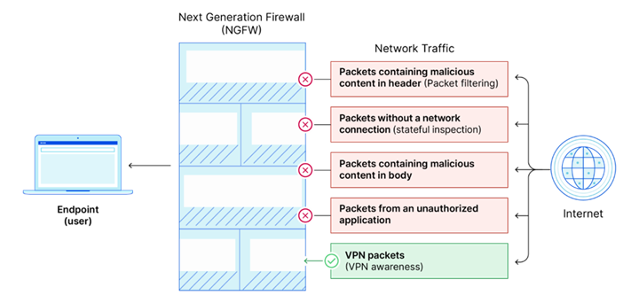
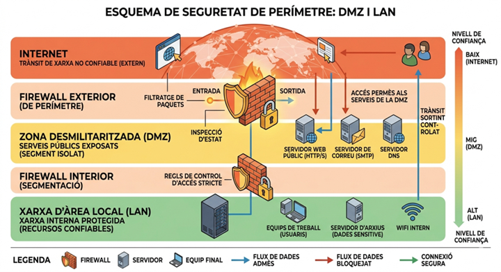
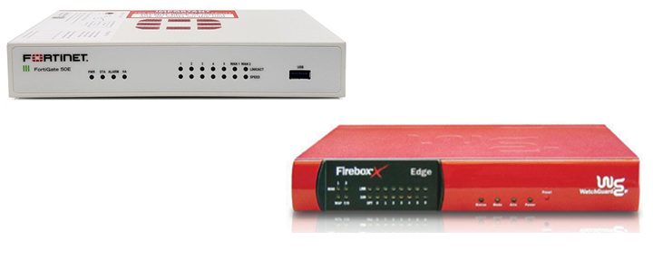
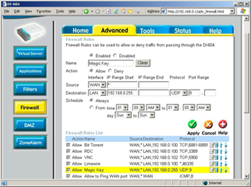
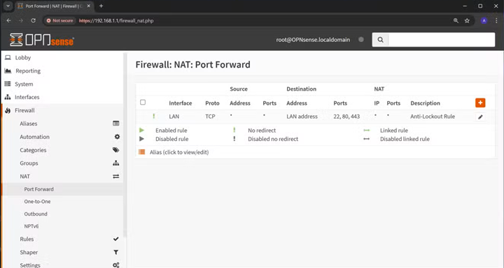

# AA4 El tallafocs (Firewall)

## Taula de continguts

- [El tallafocs](#el-tallafocs)
- [Classificació dels tallafocs](#classificació-dels-tallafocs)
- [Filtrat de paquets](#filtrat-de-paquets)
- [Tipus de tallafocs segons la seva ubicació](#tipus-de-tallafocs-segons-la-seva-ubicació)
  - [Tallafocs d'equip](#tallafocs-dequip)
  - [Tallafocs perimetrals](#tallafocs-perimetrals)
    - [DMZ (Demilitarized Zone)](#dmz-demilitarized-zone)
- [Accions sobre els paquets](#accions-sobre-els-paquets)
- [Solucions de firewall perimetral](#solucions-de-firewall-perimetral)
  - [Solucions hardware](#solucions-hardware)
  - [Solucions integrades en routers](#solucions-integrades-en-routers)
  - [Solucions software](#solucions-software)
- [Enllaços d'interès](#enllaços-dinterès)

---

## El tallafocs

Un tallafocs actua com un mur de protecció entre una xarxa interna i una xarxa externa o entre un equip i una xarxa. És un element bàsic dins la protecció contra atacs a través de la xarxa.

A nivell general, podem dir que el tallafocs és un sistema que controla el trànsit de xarxa entre dues zones, permetent o bloquejant el pas de paquets segons unes regles establertes. Aquestes regles poden basar-se en adreces IP, ports, protocols i altres criteris. Per tant, bàsicament opera sobre la capa 3 (Internet Protocol) i la capa 4 (Transport Protocol) del model OSI, tot i que els models més avançats poden operar també a la capa 7 (Aplicació).

## Classificació dels tallafocs

Els firewall es poden classificar-se segons el tipus de filtrat que realitzen i segons la seva ubicació dins la xarxa (quin trànsit filtren).

```Mermaid
graph LR
    A[Tipus tallafoc] --> B[Tipus filtrat]
    A --> C[Ubicació]
    B --> B1["Paquets (1ª generació)"]
    B --> B2["Estat (2ª generació)"]
    B --> B3["Aplicació (3ª generació)"]
    C --> C1[Equip]
    C --> C2[Perimetral]
```

## Filtrat de paquets

El tallafocs de primera generació o **stateless firewall** funciona com a filtre de paquets; és a dir, analitza la informació bàsica del paquet, com ara la font i destinació originals, el port o el protocol utilitzats, i la compara amb una llista predefinida de regles.

Exemples:

- Blocar accessos al nostre servidor des d'una xarxa externa concreta.
- Impedir les connexions a un port específic.

Aquest tipus de firewall és molt limitat, ja que només té en compte el sentit del trànsit i els valors de les adreces i els ports. Per aquest motiu, es va evolucionar cap els **staful firewalls**, que són els de segona generació. Aquests, a més de les característiques del filtrat de paquets, poden analitzar l'estat de la connexió i permetre o bloquejar el trànsit segons aquest estat. Per exemple, a una xarxa LAN podem prohibir el trànsit d'entrada, però permeten que les connexions iniciades des de la LAN puguin rebre respostes. Això és possible gràcies a que el tallafocs manté un registre de les connexions establertes i permet el trànsit de resposta només si hi ha hagut una connexió prèvia. La majoria de tallafocs bàsics actuals són d'aquest tipus.

Un tercer tipus més avançat és el tallafocs de tercera generació, que a més de les característiques dels anteriors, pot analitzar el contingut de les aplicacions i permetre o bloquejar el trànsit segons aquest contingut. Aquests tallafocs són capaços d'identificar aplicacions específiques i aplicar regles basades en el comportament de l'aplicació, com ara bloquejar certs tipus de trànsit d'una aplicació específica. És a dir, no només analitza les capçaleres de les diferents capes, sinó que inspecciona el cos de cada paquet, això li permet identificar trànsit potencialment nociu, encara que utilitzi ports i protocols legítims.



Font:[Cloudfare](https://www.cloudflare.com/es-es/learning/security/what-is-next-generation-firewall-ngfw/)

> 💡**Nota**: Existeixen també els que es denominen firewalls d'aplicació, que són eines específiques per donar seguretat a serveis concrets. Alguns dels més popular:
>
>- Web Application Firewall (WAF): protegeix aplicacions web filtrant i monitoritzant el trànsit HTTP.
>- Email Firewall: s’encarrega de filtrar correus electrònics per protegir d’spam, malware, phising, etc.

## Tipus de tallafocs segons la seva ubicació

- **Firewall d’equip**: servei (software) que inclou un equip i que controla les connexions d’aquest amb la resta de la xarxa.

- **Firewall perimetral**: dispositiu que filtra el trànsit entre una xarxa i l’exterior.

### Tallafocs d’equip

Filtren les connexions entrants i sortints d’un equip.Són sempre de programari, s’instal·la en un determinat ordinador i filtra les connexions entre aquest ordinador i la xarxa.

Actualment, la majoria de sistemes operatius ja el porten incorporat, tot i que n’hi ha moltes solucions comercials.

Alguns exemples:

- Windows: Windows Defender Firewall, Comodo Firewall, ZoneAlarm, TinyWall, GlassWire.

- Linux: Iptables, UFW, Firewalld.

- macOS: Incorpora un firewall bàsic tot i que n’hi ha moltes solucions comercials: Sophos, Intego, etc.

### Tallafocs perimetrals

Són dispositius que es col·loquen entre la xarxa interna i la xarxa externa (Internet) i que filtren el trànsit entre ambdues. Poden ser de programari o de maquinari, tot i que els més habituals són els de maquinari.

#### DMZ (Demilitarized Zone)

Zona de la xarxa interna que ha d’acceptar peticions de connexió de l’exterior.

Vulnerable a atacs provinents de l’exterior:

- Denegacions de servei
- Escalada de privilegis
- Un atacant es pot fer amb el control d’una màquina i el perill és que pugui atacar la resta de la xarxa.

Per aquest motiu, la DMZ ha d'estar separada de la resta de la xarxa interna i protegida per un tallafocs. Les connexions entra la xarxa local i la DMZ també han d'estar filtrades pel tallafocs.

> ❗Separar la DMZ de la LAN ens permet mantenir el principi de mínim privilegi, cap equip de la xarxa local (LAN) ha de poder rebre connexions entrants, ni d'Internet ni de la DMZ.

Al següent esquema es pot veure el model de xarxa amb DMZ i tallafocs perimetral:



## Accions sobre els paquets

Un firewall pot realitzar diferents accions sobre els paquets que passen per ell, segons les regles establertes:

- **Accept**: el paquet passa a la xarxa de destinació.
- **Reject**: el paquet és descartat i s'envia un missatge de "Port unreachable" al remitent.
- **Drop**: el paquet és descartat de forma silenciosa.
- **Inspect**: si el firewall és de tercera generació, pot inspeccionar el contingut del paquet i decidir si el deixa passar o no.

> 💡**Nota**: no s'inspeccionen tots els paquets perquè això generaria un coll d'ampolla a la xarxa. Per això, cal triar estratègies per decidir quins paquets s'han d'inspeccionar i quins no. Per exemple, es poden inspeccionar només els paquets que passen per ports específics o que pertanyen a aplicacions concretes.

## Solucions de firewall perimetral

Ja hem comentat que els tallafocs d'equip són sempre programes que estan instal·lats a l'equip a protegir, en el cas dels tallafocs perimetrals, poden ser de programari o de maquinari.

### Solucions hardware

Actualment integren eines extra com antivirus, IDS/IPS, VPN, filtrat de continguts, etc., de manera que es denominen UTM (Unified Threat Management). Alguns exemples:

- Fortinet FortiGate
- Sophos XG Firewall
- WatchGuard Firebox
- Barracuda NextGen Firewall



Les solucions per hardware tenen l'avantatge de ser més fàcils d'instal·lar i configurar, ja que normalment venen amb una interfície web que permet configurar-les de forma senzilla. A més, solen tenir un rendiment superior al d'una solució de programari, ja que estan optimitzades per a aquesta funció. L'inconvenient és que poden ser solucions força cares.

### Solucions integrades en routers

La major part de routers per accedir a Internet disposen d’un firewall. És una solució econòmica ja que va integrat al hardware que disposem, però sovint té poques opcions de configuració.

- Útil per configuracions típiques
- Molt limitades en quant opcions.



### Solucions software

Poden utilitzar una màquina física dedicada o una de virtual, això és especialment útil quan es vol protegir una xarxa virtualitzada per exemple en un cloud públic. Alguns exemples:

- IPCop, IPFire (Linux)
- Sophos
- VyOS
- OpnSense (FreeBSD)
- PfSense (FreeBSD)



## Enllaços d'interès

1. [Serg Vergara. Arquitectura y Diseño de Seguridad de Red Perimetral](https://sergvergara.wordpress.com/2011/03/14/arquitectura-y-diseno-de-seguridad-perimetral/)

2. [RedIRIS. Cortafuegos: Conceptos teóricos](https://www.rediris.es/cert/doc/unixsec/node23.html)

3. [Cloudfare. What is a Next Generation Firewall (NGFW)?](https://www.cloudflare.com/es-es/learning/security/what-is-next-generation-firewall-ngfw/)

4. [Fortinet. ¿Qué es la gestión unificada de amenazas (UTM)?](https://www.fortinet.com/lat/resources/cyberglossary/unified-threat-management)
